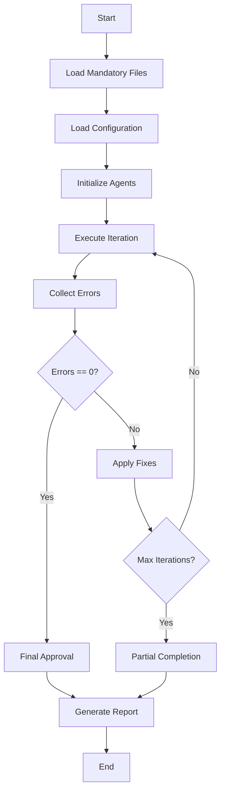
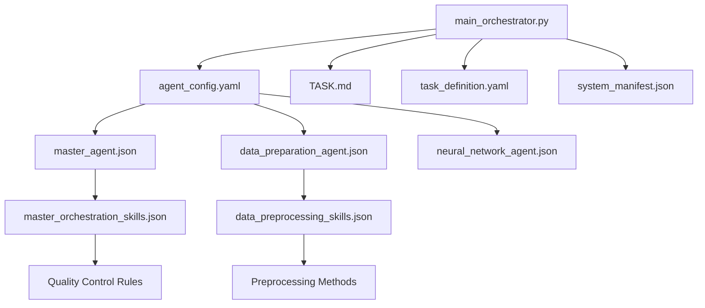

# NIR Intelligence Platform - Development Summary

## Overview

This document provides a comprehensive summary of the NIR Intelligence Platform (NIR-IP) development setup, including all task, agent, and skill definitions that have been created to enable the development process.

## Project Structure

```
NIR_Mistral/
├── tasks/                      # Task definition files
│   └── nir_platform_implementation.yaml
├── agents/                     # Agent definition files
│   ├── master_agent.json
│   ├── data_preparation_agent.json
│   ├── neural_network_agent.json
│   └── (other agents to be added)
├── skills/                     # Skill definition files
│   ├── master_orchestration_skills.json
│   ├── data_preprocessing_skills.json
│   └── (other skills to be added)
├── config/                     # Configuration files
│   └── agent_config.yaml
├── scripts/                    # Execution scripts
│   └── main_orchestrator.py
├── docker-compose.yml          # Container configuration
├── requirements.txt            # Python dependencies
├── README.md                   # Project documentation
└── DEVELOPMENT_SUMMARY.md      # This file
```

## 1. Task Definitions

### Main Task File: `tasks/nir_platform_implementation.yaml`

**Purpose**: Comprehensive task definition for the entire NIR Intelligence Platform implementation.

**Key Components**:
- **Project Metadata**: Name, version, description, timeline
- **Execution Parameters**: Iterative process with stop conditions
- **Phased Approach**: 9 phases from initialization to federated learning
- **Agent Definitions**: 14 agents with roles and responsibilities
- **Quality Control**: Strict quality standards and acceptance criteria
- **Documentation Requirements**: Comprehensive reporting structure

**Phases Defined**:
1. **Initialization**: Environment setup (UVX, Docker)
2. **Data Preparation**: Data import and preprocessing
3. **Quality Assurance**: Data and sensor quality assessment
4. **Analysis**: Parallel statistical and neural network analysis
5. **Calibration**: Model creation and optimization
6. **Database Integration**: Vector and relational storage
7. **Application Development**: Web interface and APIs
8. **Documentation**: Automated report generation
9. **Federated Learning**: Optional distributed learning

## 2. Agent Definitions

### Master Agent: `agents/master_agent.json`

**Role**: Central orchestrator and quality controller

**Key Responsibilities**:
- Overall project planning and coordination
- Agent orchestration and dependency management
- Quality control enforcement
- Conflict resolution
- Final approval and release management

**Configuration**:
- Execution order for all 14 agents
- Quality control rules (zero tolerance for errors)
- Iteration settings (max 100 iterations)
- Communication protocols

### Data Preparation Agent: `agents/data_preparation_agent.json`

**Role**: Data import, cleaning, and preprocessing

**Capabilities**:
- Multi-format data import (CSV, JSON, HDF5, JDX, SPC, TXT)
- Comprehensive data cleaning and validation
- NIR-specific preprocessing techniques
- Metadata extraction and management
- Quality assessment and reporting

**Preprocessing Methods**:
- Standard Normal Variate (SNV)
- Multiplicative Scatter Correction (MSC)
- Savitzky-Golay smoothing
- Baseline correction
- Detrending

### Neural Network Agent: `agents/neural_network_agent.json`

**Role**: Deep learning analysis for NIR spectroscopy

**Supported Models**:
- **CNN**: 1D convolutional networks for spectral feature extraction
- **MLP**: Multi-layer perceptrons for regression tasks
- **Autoencoder**: Dimensionality reduction and feature extraction

**Features**:
- Hyperparameter optimization (Bayesian, Grid Search)
- Parallel execution with statistical analysis
- Comprehensive evaluation metrics
- Model interpretability tools
- Performance requirements (R² ≥ 0.80)

## 3. Skill Definitions

### Master Orchestration Skills: `skills/master_orchestration_skills.json`

**Associated Agent**: Master Implementation Agent

**Core Skills**:
1. **Project Planning**: Task decomposition, dependency mapping, resource allocation
2. **Agent Coordination**: Execution order management, parallel execution, load balancing
3. **Quality Control**: Error detection, metric-based evaluation, threshold enforcement
4. **Conflict Resolution**: Dependency analysis, priority-based resolution, mediation
5. **Iterative Improvement**: Progress monitoring, bottleneck identification, adaptive planning
6. **Final Approval**: Comprehensive review, acceptance testing, release management

**Performance Indicators**:
- Agents coordinated
- Conflicts resolved
- Iterations completed
- Quality improvement rate
- Project completion time

### Data Preprocessing Skills: `skills/data_preprocessing_skills.json`

**Associated Agent**: Data Preparation Agent

**Specialized Skills**:
1. **Data Import**: Format detection, validation, batch processing
2. **Data Cleaning**: Missing value handling, outlier detection, noise reduction
3. **Spectral Preprocessing**: NIR-specific techniques (SNV, MSC, Savitzky-Golay)
4. **Metadata Management**: Extraction, validation, enrichment, prioritization
5. **Quality Assessment**: Metric calculation, threshold comparison, reporting

**Supported Formats**:
- CSV, JSON, HDF5 (full metadata support)
- JDX, SPC (spectroscopy standards)
- TXT (minimal metadata)

**Quality Metrics**:
- Data completeness (≥95%)
- Value range compliance (≥98%)
- Outlier percentage (≤5%)
- Signal-to-noise ratio (≥20)

## 4. Configuration Files

### Agent Configuration: `config/agent_config.yaml`

**Purpose**: Central configuration for all agents and system parameters

**Key Sections**:
- **Global Settings**: Project name, environment, logging
- **Agent Configurations**: Individual parameters for each of the 14 agents
- **Dependency Management**: Agent execution order and dependencies
- **Quality Control**: System-wide quality standards
- **Execution Order**: Topological sort for agent execution

**Agent Parameters Example**:
```yaml
agents:
  data_preparation_agent:
    enabled: true
    version: "1.0.0"
    params:
      input_directory: "data/raw"
      output_directory: "data/processed"
      default_format: "HDF5"
      batch_size: 1000
      preprocessing_methods: ["SNV", "MSC", "Savitzky-Golay"]
```

## 5. Execution Scripts

### Main Orchestrator: `scripts/main_orchestrator.py`

**Purpose**: Central execution script for the multi-agent system

**Key Features**:
- **Mandatory File Validation**: Ensures TASK.md, task_definition.yaml, and system_manifest.json are present
- **Dynamic Agent Loading**: Imports and initializes agents based on configuration
- **Iterative Execution**: Runs agents in dependency order with error checking
- **Error Collection**: Aggregates errors from all agents
- **Self-Optimization**: Applies suggested fixes between iterations
- **Reporting**: Generates comprehensive implementation reports

**Execution Flow**:
1. Load mandatory files
2. Load configuration
3. Initialize all agents
4. Execute iterations (up to 100)
5. Collect and analyze errors
6. Apply fixes
7. Generate final report

**Error Handling**:
- Critical errors: Agent initialization failure, dependency cycles
- High errors: Execution failures, configuration issues
- Medium/Low errors: Warning-level issues

## 6. Development Workflow

### Setup Process

```bash
# 1. Create project structure
mkdir -p NIR_Mistral/{tasks,agents,skills,config,scripts,data/{raw,processed},output,logs}

# 2. Create task definitions
# (See tasks/nir_platform_implementation.yaml)

# 3. Create agent definitions
# (See agents/*.json files)

# 4. Create skill definitions
# (See skills/*.json files)

# 5. Create configuration
# (See config/agent_config.yaml)

# 6. Implement orchestrator
# (See scripts/main_orchestrator.py)

# 7. Set up environment
python -m venv venv
source venv/bin/activate
pip install -r requirements.txt

# 8. Start containers
docker-compose up -d

# 9. Run orchestrator
python scripts/main_orchestrator.py
```

### Iterative Development Cycle



## 7. Quality Control Mechanism

### Error Classification

| Severity | Description | Handling |
|----------|-------------|----------|
| CRITICAL | System-threatening errors | Immediate stop |
| HIGH | Major functionality issues | Requires fix |
| MEDIUM | Performance warnings | Monitored |
| LOW | Minor issues | Logged |

### Stop Conditions

- **Open Errors**: 0
- **Critical Warnings**: 0
- **Change Requests**: 0
- **Maximum Iterations**: 100

### Quality Metrics

- **Data Quality**: Completeness, validity, consistency
- **Model Performance**: R² score ≥ 0.80
- **Documentation**: Complete and accurate
- **Agent Coordination**: No conflicts or deadlocks
- **Execution Time**: Within defined limits

## 8. Integration with Existing Files

### Relationship to Existing Documentation

The developed files integrate with and extend the existing project documentation:

- **TASK.md**: High-level mission and objectives (referenced by all agents)
- **task_definition.yaml**: Detailed technical specifications (used for validation)
- **system_manifest.json**: System configuration (loaded by orchestrator)
- **codestral-multiagent.md**: Architecture reference (implementation guide)
- **agent-skill-prompt.md**: Agent capabilities reference (skill definition basis)

### File Interdependencies



## 9. Implementation Status

### Completed Components

✅ **Task Definitions**: Comprehensive YAML-based task specification
✅ **Agent Definitions**: JSON-based agent configurations (3/14 agents)
✅ **Skill Definitions**: Detailed skill specifications (2/14 skills)
✅ **Configuration**: Central YAML configuration system
✅ **Orchestrator**: Main execution script with error handling
✅ **Documentation**: Comprehensive README and development summary
✅ **Containerization**: Docker Compose configuration
✅ **Dependencies**: Complete requirements.txt

### Components to Develop

🔄 **Additional Agent Definitions** (11 remaining):
- Metadata Agent
- Sensor Quality Agent
- Statistical Analysis Agent
- Calibration Agent
- Weaviate Agent
- FAISS Agent
- PostgreSQL Agent
- Django Agent
- MCP Agent
- Quarto Agent
- Flower Agent

🔄 **Additional Skill Definitions** (12 remaining):
- Corresponding skills for each remaining agent

🔄 **Agent Implementations**:
- Python classes for each agent inheriting from BaseAgent
- Specific execution logic for each agent's responsibilities

🔄 **Testing Framework**:
- Unit tests for individual agents
- Integration tests for agent interactions
- End-to-end system tests

## 10. Next Steps

### Immediate Priorities

1. **Complete Agent Definitions**: Create JSON files for remaining 11 agents
2. **Complete Skill Definitions**: Create skill files for remaining agents
3. **Implement Agent Classes**: Python implementations for each agent
4. **Develop Testing Framework**: Comprehensive test coverage
5. **Enhance Error Handling**: More sophisticated recovery mechanisms

### Medium-Term Goals

1. **Performance Optimization**: Parallel execution improvements
2. **Monitoring Dashboard**: Real-time progress tracking
3. **Agent Communication**: Enhanced inter-agent messaging
4. **Configuration UI**: Web-based configuration editor
5. **Plugin System**: Extensible agent architecture

### Long-Term Vision

1. **Cloud Deployment**: Kubernetes-based scaling
2. **Mobile Interface**: Companion mobile application
3. **Marketplace**: Agent and skill marketplace
4. **Community Edition**: Open-source version
5. **Enterprise Features**: Advanced security and compliance

## 11. Best Practices

### Development Guidelines

1. **Modular Design**: Each agent should be self-contained
2. **Clear Interfaces**: Well-defined inputs and outputs
3. **Comprehensive Error Handling**: Graceful degradation
4. **Detailed Logging**: Traceable execution history
5. **Configuration-Driven**: Minimal hardcoding
6. **Performance Monitoring**: Resource usage tracking
7. **Documentation First**: Skills and capabilities clearly defined

### Quality Assurance

1. **Mandatory File Reading**: All agents must read core files first
2. **Iterative Improvement**: Continuous quality enhancement
3. **Cross-Agent Review**: Peer validation of results
4. **Automated Testing**: Comprehensive test coverage
5. **Performance Benchmarks**: Measurable quality metrics
6. **Version Control**: Semantic versioning for all components

## 12. Troubleshooting

### Common Issues

**Problem**: Agent initialization failure
- **Cause**: Missing dependencies or configuration errors
- **Solution**: Check agent configuration and requirements

**Problem**: Dependency cycles detected
- **Cause**: Circular dependencies between agents
- **Solution**: Review execution order in configuration

**Problem**: Quality thresholds not met
- **Cause**: Insufficient data quality or model performance
- **Solution**: Review preprocessing and analysis parameters

**Problem**: Maximum iterations reached
- **Cause**: Persistent errors not being resolved
- **Solution**: Analyze error patterns and adjust strategies

### Debugging Tools

```bash
# View detailed logs
tail -f logs/nir_platform.log

# Run specific agent in isolation
python -m agents.data_preparation_agent --debug

# Validate configuration
python scripts/validate_config.py

# Check agent dependencies
python scripts/check_dependencies.py
```

## Conclusion

This development setup provides a comprehensive foundation for the NIR Intelligence Platform. The task, agent, and skill definitions create a clear structure for implementation, while the orchestrator script enables automated execution and quality control. The iterative development approach ensures continuous improvement until all quality thresholds are met.

The next phase involves completing the remaining agent and skill definitions, implementing the Python classes for each agent, and developing the testing framework to ensure robust operation.

**Status**: ✅ Foundation Complete | 🔄 Implementation In Progress | 🎯 Production Ready Target: Q4 2026