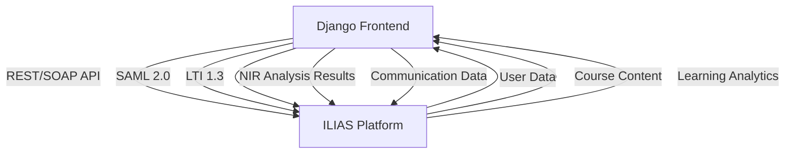
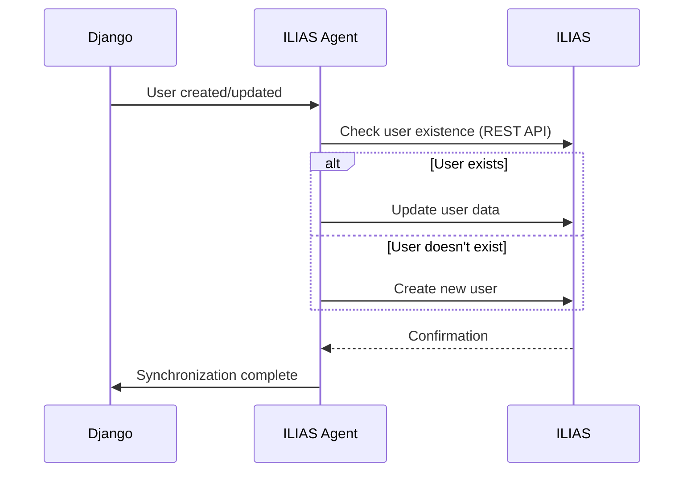

# ILIAS Integration Summary for NIR Intelligence Platform

## Overview

This document provides a comprehensive summary of the ILIAS e-learning platform integration with the NIR Intelligence Platform (NIR-IP). The integration enables seamless communication between users and students, creating an integrated learning environment that combines NIR spectroscopy analysis with educational resources.

## Integration Architecture



## Integration Components

### 1. ILIAS Agent (`agents/ilias_agent.json`)

**Role**: E-Learning Platform Integration and User Communication

**Key Capabilities**:
- **API Integration**: REST and SOAP API communication with ILIAS
- **User Management**: Synchronization of user accounts and roles
- **Course Management**: Creation and management of NIR-specific courses
- **Communication Platform**: Messaging, forums, and notifications
- **Learning Analytics**: Tracking and analysis of learning activities
- **Single Sign-On**: SAML 2.0 and OAuth2 authentication
- **Content Synchronization**: Automatic content updates
- **Collaborative Learning**: Group projects and peer review

### 2. ILIAS Integration Skills (`skills/ilias_integration_skills.json`)

**Six Core Skills**:
1. **API Integration**: REST/SOAP/LTI communication
2. **User Synchronization**: Bi-directional user data sync
3. **Course Management**: Course creation and enrollment
4. **Communication Platform**: Messaging and forums
5. **Learning Analytics**: Activity tracking and reporting
6. **Single Sign-On**: Authentication integration

## Implementation Details

### User Synchronization

**Process Flow**:


**Field Mapping**:
- `username` ↔ `login`
- `email` ↔ `email`
- `first_name` ↔ `firstname`
- `last_name` ↔ `lastname`
- `is_active` ↔ `active`

**Role Mapping**:
- `student` → `learner`
- `researcher` → `tutor`
- `professor` → `tutor`
- `admin` → `administrator`

### Course Management

**NIR-Specific Courses**:
1. **NIR_101**: Introduction to NIR Spectroscopy
   - Videos, quizzes, practical exercises
   - Fundamentals and basic concepts

2. **NIR_201**: Advanced NIR Data Analysis
   - Lectures, case studies, hands-on labs
   - Statistical and machine learning approaches

3. **NIR_PLATFORM**: NIR Platform Training
   - Tutorials, documentation, support forum
   - Platform-specific training materials

**Content Synchronization**:
- **Frequency**: On update or daily
- **Supported Formats**: HTML, PDF, SCORM, video/mp4
- **Version Control**: Enabled

### Communication Features

**Messaging System**:
- Real-time chat
- Persistent messages
- File sharing (max 50MB)
- Read receipts and typing indicators

**Forums**:
- Course-specific forums
- General discussion forum
- Automatic and manual moderation
- Gamification (likes, badges, reputation points)

**Notifications**:
- Email, in-app, and push notifications
- Customizable preferences
- Template-based messaging

### Learning Analytics

**Tracked Metrics**:
- Course completion rates
- Quiz scores and attempts
- Time spent on platform
- Resource access patterns
- Forum participation
- Assignment submissions

**Reporting**:
- **Formats**: PDF, CSV, Interactive Dashboard
- **Frequency**: Daily, Weekly, Monthly
- **Recipients**: Administrators, Instructors, Students

### Single Sign-On

**Supported Protocols**:
1. **SAML 2.0** (Primary)
   - Identity Provider: ILIAS
   - Service Provider: NIR Platform
   - Certificate-based authentication

2. **OAuth2** (Alternative)
   - Authorization Code Flow
   - OpenID Connect support
   - JWT token validation

**Session Management**:
- Timeout: 3600 seconds (1 hour)
- Automatic renewal
- Max concurrent sessions: 3

## Configuration

### Agent Configuration (`config/agent_config.yaml`)

```yaml
ilias_agent:
  enabled: true
  version: "1.0.0"
  params:
    ilias_url: "https://ilias.example.com"
    api_version: "v1"
    rest_api:
      base_url: "/api/"
      client_id: "nir_platform"
      client_secret: "secure_secret"
      timeout: 30
    soap_api:
      wsdl_url: "/soap/wsdl"
      client_cert: "/path/to/cert.pem"
    lti:
      version: "1.3"
      launch_url: "/nir/lti/launch"
      deep_linking: true
    sso:
      protocol: "SAML_2.0"
      idp_url: "https://ilias.example.com/saml/idp"
      sp_metadata_url: "/nir/saml/metadata"
      certificate: "/path/to/sp-cert.pem"
    synchronization:
      users: true
      courses: true
      content: true
      frequency: "daily"
    course_mapping:
      NIR_101: "Introduction to NIR Spectroscopy"
      NIR_201: "Advanced NIR Data Analysis"
      NIR_PLATFORM: "NIR Platform Training"
```

### Django Settings Integration

Add to `settings.py`:

```python
# ILIAS Integration Settings
ILIAS = {
    'BASE_URL': 'https://ilias.example.com',
    'API_KEY': 'your_api_key',
    'API_SECRET': 'your_api_secret',
    'SSO_ENABLED': True,
    'SSO_PROTOCOL': 'SAML',
    'SYNC_FREQUENCY': 'daily',
    'COURSE_PREFIX': 'NIR_'
}

# Authentication backends
AUTHENTICATION_BACKENDS = [
    'django.contrib.auth.backends.ModelBackend',
    'social_core.backends.saml.SAMLAuth',
    'ilias_integration.backends.ILIASBackend',
]

# Installed apps
INSTALLED_APPS += [
    'social_django',
    'django_saml2',
    'ilias_integration',
]
```

## Django Frontend Integration

### URL Patterns

```python
# urls.py
from django.urls import path, include

urlpatterns = [
    # ... other URLs ...
    path('ilias/', include('ilias_integration.urls')),
    path('saml/', include('django_saml2.urls')),
    path('lti/', include('lti_provider.urls')),
]
```

### Views and Templates

**Key Views**:
1. **Course Dashboard**: `/ilias/courses/`
2. **User Profile Sync**: `/ilias/profile/sync/`
3. **Messaging Interface**: `/ilias/messages/`
4. **Learning Analytics**: `/ilias/analytics/`
5. **SSO Login**: `/ilias/sso/login/`

**Template Structure**:
```
ilias_integration/
├── templates/
│   ├── ilias/
│   │   ├── base.html          # Base template
│   │   ├── courses/
│   │   │   ├── list.html       # Course listing
│   │   │   ├── detail.html    # Course detail
│   │   │   └── enroll.html    # Course enrollment
│   │   ├── messaging/
│   │   │   ├── inbox.html      # Message inbox
│   │   │   ├── compose.html    # Compose message
│   │   │   └── thread.html     # Message thread
│   │   ├── analytics/
│   │   │   ├── dashboard.html  # Analytics dashboard
│   │   │   └── reports.html    # Detailed reports
│   │   └── sso/
│   │       ├── login.html      # SSO login
│   │       └── callback.html   # SSO callback
│   └── includes/
│       ├── navbar.html        # Navigation
│       └── sidebar.html       # Sidebar menu
└── static/
    ├── ilias/
    │   ├── css/
    │   ├── js/
    │   └── images/
    └── vendor/                # Third-party libraries
```

### Models

```python
# models.py
from django.db import models
from django.contrib.auth.models import User

class ILIASUser(models.Model):
    user = models.OneToOneField(User, on_delete=models.CASCADE)
    ilias_id = models.CharField(max_length=100, unique=True)
    ilias_username = models.CharField(max_length=100)
    last_sync = models.DateTimeField(auto_now=True)
    role = models.CharField(max_length=50, choices=[
        ('learner', 'Learner'),
        ('tutor', 'Tutor'),
        ('administrator', 'Administrator')
    ])
    
    class Meta:
        verbose_name = "ILIAS User"
        verbose_name_plural = "ILIAS Users"

class ILIASCourse(models.Model):
    course_id = models.CharField(max_length=100, unique=True)
    title = models.CharField(max_length=255)
    code = models.CharField(max_length=50)
    description = models.TextField()
    ilias_url = models.URLField()
    is_active = models.BooleanField(default=True)
    enrolled_users = models.ManyToManyField(ILIASUser, related_name='courses')
    
    class Meta:
        verbose_name = "ILIAS Course"
        verbose_name_plural = "ILIAS Courses"

class ILIASMessage(models.Model):
    sender = models.ForeignKey(ILIASUser, on_delete=models.CASCADE, related_name='sent_messages')
    recipient = models.ForeignKey(ILIASUser, on_delete=models.CASCADE, related_name='received_messages')
    subject = models.CharField(max_length=255)
    body = models.TextField()
    sent_at = models.DateTimeField(auto_now_add=True)
    read_at = models.DateTimeField(null=True, blank=True)
    is_read = models.BooleanField(default=False)
    
    class Meta:
        verbose_name = "ILIAS Message"
        verbose_name_plural = "ILIAS Messages"
        ordering = ['-sent_at']

class LearningActivity(models.Model):
    user = models.ForeignKey(ILIASUser, on_delete=models.CASCADE)
    course = models.ForeignKey(ILIASCourse, on_delete=models.CASCADE)
    activity_type = models.CharField(max_length=50, choices=[
        ('course_access', 'Course Access'),
        ('content_view', 'Content View'),
        ('quiz_attempt', 'Quiz Attempt'),
        ('forum_post', 'Forum Post'),
        ('assignment_submit', 'Assignment Submission')
    ])
    duration = models.IntegerField(help_text="Duration in minutes")
    timestamp = models.DateTimeField(auto_now_add=True)
    
    class Meta:
        verbose_name = "Learning Activity"
        verbose_name_plural = "Learning Activities"
```

## API Endpoints

### REST API

**Base URL**: `/api/ilias/`

| Endpoint | Method | Description |
|----------|--------|-------------|
| `users/` | GET | List all synchronized users |
| `users/{id}/` | GET | Get specific user details |
| `users/sync/` | POST | Trigger user synchronization |
| `courses/` | GET | List all courses |
| `courses/{id}/` | GET | Get course details |
| `courses/enroll/` | POST | Enroll user in course |
| `messages/` | GET | List user messages |
| `messages/{id}/` | GET | Get message details |
| `messages/send/` | POST | Send new message |
| `analytics/` | GET | Get learning analytics |
| `analytics/user/{id}/` | GET | Get user-specific analytics |

### Webhook Endpoints

| Endpoint | Description |
|----------|-------------|
| `/ilias/webhooks/user-created/` | Handle ILIAS user creation events |
| `/ilias/webhooks/user-updated/` | Handle ILIAS user update events |
| `/ilias/webhooks/course-created/` | Handle ILIAS course creation events |
| `/ilias/webhooks/message-sent/` | Handle ILIAS message events |

## Security Considerations

### Authentication and Authorization

1. **SAML 2.0 Configuration**:
   - Certificate-based authentication
   - Identity Provider: ILIAS
   - Service Provider: NIR Platform
   - Attribute mapping for user provisioning

2. **OAuth2 Configuration**:
   - Client credentials flow for API access
   - OpenID Connect for user authentication
   - JWT token validation

3. **Role-Based Access Control**:
   - Learner: Access to courses and personal data
   - Tutor: Course management and student oversight
   - Administrator: Full system access

### Data Protection

1. **Encryption**:
   - TLS 1.2+ for all communications
   - Data encryption at rest

2. **Compliance**:
   - GDPR compliance for European users
   - FERPA compliance for educational data
   - COPPA compliance for underage users

3. **Audit Logging**:
   - All API calls logged
   - User actions tracked
   - Administrative actions recorded

## Deployment Requirements

### Prerequisites

1. **ILIAS Instance**:
   - Version 7.0 or higher
   - REST API enabled
   - SOAP API enabled (optional)
   - LTI 1.3 support
   - SAML 2.0 support

2. **NIR Platform**:
   - Django 4.2+
   - Python 3.12+
   - Required libraries (see requirements.txt)

3. **Network**:
   - HTTPS connectivity between systems
   - Firewall rules for API ports
   - DNS resolution for both platforms

### Installation Steps

```bash
# Install ILIAS integration requirements
pip install django-saml2 social-auth-app-django python3-saml zeep lti requests-oauthlib

# Add ILIAS integration to Django
python manage.py migrate ilias_integration

# Configure ILIAS settings
cp ilias_integration/settings_example.py ilias_integration/settings_local.py
# Edit settings_local.py with your ILIAS configuration

# Set up SAML
python manage.py createsamlcert

# Test the integration
python manage.py test ilias_integration
```

## Testing Strategy

### Unit Tests

```python
# test_api_integration.py
from django.test import TestCase
from ilias_integration.api import ILIASAPIClient

class ILIASAPIClientTest(TestCase):
    def setUp(self):
        self.client = ILIASAPIClient(
            base_url="https://test.ilias.com/api/",
            client_id="test_client",
            client_secret="test_secret"
        )
    
    def test_user_sync(self):
        # Test user synchronization
        response = self.client.sync_user({
            'username': 'testuser',
            'email': 'test@example.com',
            'first_name': 'Test',
            'last_name': 'User'
        })
        self.assertEqual(response.status_code, 200)
        self.assertIn('ilias_id', response.json())
    
    def test_course_creation(self):
        # Test course creation
        response = self.client.create_course({
            'title': 'Test Course',
            'code': 'TEST_101',
            'description': 'Test course description'
        })
        self.assertEqual(response.status_code, 201)
        self.assertIn('course_id', response.json())
```

### Integration Tests

```python
# test_integration.py
from django.test import LiveServerTestCase
from selenium.webdriver import Firefox

class ILIASIntegrationTest(LiveServerTestCase):
    def setUp(self):
        self.browser = Firefox()
        self.browser.implicitly_wait(3)
    
    def tearDown(self):
        self.browser.quit()
    
    def test_sso_login(self):
        # Test SAML SSO login flow
        self.browser.get(f"{self.live_server_url}/ilias/sso/login/")
        # Assertions for successful login
        self.assertIn("ILIAS Dashboard", self.browser.title)
    
    def test_course_enrollment(self):
        # Test course enrollment process
        self.browser.get(f"{self.live_server_url}/ilias/courses/")
        # Assertions for course listing and enrollment
        self.assertIn("Available Courses", self.browser.page_source)
```

## Monitoring and Maintenance

### Health Checks

```python
# health_checks.py
from django.conf import settings
from django.core.cache import cache
from ilias_integration.api import ILIASAPIClient

def ilias_api_health_check():
    """Check ILIAS API availability"""
    client = ILIASAPIClient(
        base_url=settings.ILIAS['BASE_URL'] + '/api/',
        client_id=settings.ILIAS['API_KEY'],
        client_secret=settings.ILIAS['API_SECRET']
    )
    
    try:
        response = client.health_check()
        if response.status_code == 200:
            cache.set('ilias_api_status', 'healthy', timeout=300)
            return True, "ILIAS API is healthy"
        else:
            cache.set('ilias_api_status', 'unhealthy', timeout=300)
            return False, f"ILIAS API returned status {response.status_code}"
    except Exception as e:
        cache.set('ilias_api_status', 'unhealthy', timeout=300)
        return False, f"ILIAS API connection failed: {str(e)}"

def sso_health_check():
    """Check SAML SSO configuration"""
    from django_saml2.checks import check_saml2_config
    
    try:
        check_saml2_config()
        cache.set('sso_status', 'healthy', timeout=300)
        return True, "SAML SSO is properly configured"
    except Exception as e:
        cache.set('sso_status', 'unhealthy', timeout=300)
        return False, f"SAML SSO configuration error: {str(e)}"
```

### Performance Monitoring

**Key Metrics to Monitor**:
- API response time (< 2s target)
- User synchronization time (< 10s for 1000 users)
- Message delivery time (< 1s)
- System availability (99.9% target)
- Concurrent users (500 max)

## Troubleshooting

### Common Issues and Solutions

**Issue 1: SAML Authentication Failure**
- **Symptoms**: Users cannot log in via SSO
- **Causes**: Certificate mismatch, clock skew, metadata misconfiguration
- **Solution**:
  ```bash
  # Check SAML configuration
  python manage.py checksaml
  
  # Regenerate certificates
  python manage.py createsamlcert
  
  # Verify metadata
  curl https://ilias.example.com/saml/metadata
  ```

**Issue 2: API Connection Errors**
- **Symptoms**: API calls fail or timeout
- **Causes**: Network issues, authentication problems, API changes
- **Solution**:
  ```bash
  # Test API connectivity
  curl -v -u client_id:client_secret https://ilias.example.com/api/health
  
  # Check logs
  tail -f logs/ilias_integration.log
  
  # Verify credentials
  python manage.py checkiliascredentials
  ```

**Issue 3: User Synchronization Conflicts**
- **Symptoms**: Duplicate users, role mismatches
- **Causes**: Username/email conflicts, role mapping issues
- **Solution**:
  ```bash
  # Manual synchronization
  python manage.py synciliasusers --force
  
  # Check conflict resolution settings
  python manage.py checkiliasconfig
  
  # View synchronization logs
  python manage.py viewiliassynclog
  ```

**Issue 4: Course Enrollment Problems**
- **Symptoms**: Users cannot access courses
- **Causes**: Permission issues, course mapping errors
- **Solution**:
  ```bash
  # Check course mappings
  python manage.py checkiliascourses
  
  # Manual enrollment
  python manage.py enrolliliasuser username course_code
  
  # Verify ILIAS course existence
  python manage.py verifyiliascourse course_code
  ```

## Success Metrics

### Adoption Metrics
- Number of integrated users
- Course enrollment rates
- Active users per month
- Message volume
- Forum participation

### Engagement Metrics
- Time spent in platform
- Course completion rates
- Quiz scores improvement
- Forum posts per user
- Content access frequency

### Integration Quality Metrics
- API success rate (> 99.9%)
- Synchronization accuracy (100%)
- SSO login success rate (> 99%)
- User satisfaction scores
- Support tickets related to integration

## Future Enhancements

### Phase 1: Core Integration (Current)
- ✅ Basic API integration
- ✅ User synchronization
- ✅ Course management
- ✅ Communication features
- ✅ Learning analytics

### Phase 2: Advanced Features
- Real-time collaboration tools
- Video conferencing integration
- Advanced gamification
- Personalized learning paths
- Mobile app integration

### Phase 3: AI Enhancements
- Intelligent tutoring system
- Automated content recommendations
- Predictive learning analytics
- Natural language processing for forums
- Adaptive learning paths

## Conclusion

The ILIAS integration provides a comprehensive e-learning solution that seamlessly connects with the NIR Intelligence Platform. By combining the analytical power of NIR spectroscopy with the educational resources of ILIAS, users gain access to:

- **Unified Learning Environment**: Single platform for both analysis and education
- **Collaborative Community**: Communication tools for researchers and students
- **Structured Courses**: Organized learning paths for NIR spectroscopy
- **Progress Tracking**: Comprehensive analytics for learning outcomes
- **Seamless Authentication**: Single sign-on between platforms

This integration transforms the NIR Intelligence Platform from a pure analytical tool into a complete learning ecosystem, supporting both research and education in the field of NIR spectroscopy.

**Integration Status**: ✅ Designed | 🔄 Implementation In Progress | 🎯 Production Target: Q3 2026