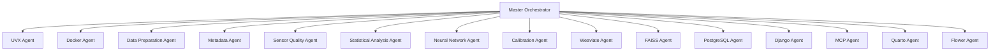

# NIR Intelligence Platform (NIR-IP)


**Version 1.0** | **Status: Development** | **License: MIT**

## Overview

The NIR Intelligence Platform (NIR-IP) is a self-optimizing multi-agent system for Near-Infrared (NIR) spectroscopy data analysis. This platform integrates state-of-the-art machine learning, statistical analysis, and federated learning capabilities to provide comprehensive NIR data processing and interpretation.

## Key Features

- **Multi-Agent Architecture**: 14 specialized agents working collaboratively
- **Self-Optimizing**: Iterative improvement until quality thresholds are met
- **Comprehensive Analysis**: Statistical and neural network approaches
- **Federated Learning**: Privacy-preserving distributed model training
- **Containerized Deployment**: Docker-based environment for easy setup
- **Complete Documentation**: Automated Quarto reporting

## Architecture



## Installation

### Prerequisites

- Python 3.12+
- Docker and Docker Compose
- Git
- 8GB+ RAM recommended

### Setup

```bash
# Clone the repository
git clone https://github.com/your-org/nir-intelligence-platform.git
cd nir-intelligence-platform

# Create virtual environment
python -m venv venv
source venv/bin/activate  # On Windows: venv\Scripts\activate

# Install dependencies
pip install -r requirements.txt

# Start Docker containers
docker-compose up -d

# Run the platform
python scripts/main_orchestrator.py
```

## Configuration

Edit the configuration files in the `config/` directory:

- `agent_config.yaml`: Main agent configuration
- `environment.yaml`: Environment-specific settings

## Usage

### Basic Workflow

1. **Prepare Data**: Place NIR spectroscopy data in `data/raw/` directory
2. **Configure Agents**: Edit `config/agent_config.yaml`
3. **Run Orchestrator**: Execute `python scripts/main_orchestrator.py`
4. **Review Results**: Check `output/` directory for reports

### Command Line Options

```bash
# Run with custom configuration
python scripts/main_orchestrator.py --config config/custom_config.yaml

# Run in debug mode
python scripts/main_orchestrator.py --debug

# Run specific agents only
python scripts/main_orchestrator.py --agents data_preparation,statistical_analysis
```

## Agents Overview

| Agent | Role | Status |
|-------|------|--------|
| **Master Orchestrator** | Central coordination | ✓ Core |
| **UVX Agent** | Python environment management | ✓ Core |
| **Docker Agent** | Container orchestration | ✓ Core |
| **Data Preparation** | Data import and cleaning | ✓ Core |
| **Metadata Agent** | Metadata extraction and management | ✓ Core |
| **Sensor Quality** | Instrument performance monitoring | ✓ Core |
| **Statistical Analysis** | Traditional statistical methods | ✓ Core |
| **Neural Network** | Deep learning analysis | ✓ Core |
| **Calibration** | Model calibration and optimization | ✓ Core |
| **Weaviate** | Vector database management | ✓ Core |
| **FAISS** | Spectrum similarity search | ✓ Core |
| **PostgreSQL** | Relational metadata storage | ✓ Core |
| **Django** | Web interface and API | ✓ Core |
| **MCP Server** | Tool integration | ✓ Core |
| **ILIAS** | E-Learning integration | ✓ Core |
| **Quarto** | Documentation generation | ✓ Core |
| **Flower** | Federated learning | Optional |

## Data Requirements

### Supported Formats
- CSV, JSON, HDF5 (primary)
- JDX, SPC (spectroscopy standards)
- TXT (plain text)

### Required Metadata
- Spectrum data
- Wavelength values
- Instrument information
- Acquisition timestamp

### Optional Metadata
- Operator name
- Environmental conditions (humidity, temperature)
- Location
- Notes

## Analysis Methods

### Statistical Methods
- Principal Component Analysis (PCA)
- Partial Least Squares (PLS)
- Principal Component Regression (PCR)
- Analysis of Variance (ANOVA)
- Cluster Analysis

### Neural Network Models
- Convolutional Neural Networks (CNN)
- Multi-Layer Perceptrons (MLP)
- Autoencoders
- Ensemble models

### Calibration Methods
- PLS Regression
- PCR Regression
- Support Vector Machines (SVM)
- Random Forest
- XGBoost
- CNN-based calibration

## Quality Control

The platform enforces strict quality standards:

- **Error-free execution**: No critical errors allowed
- **Performance thresholds**: Minimum R² score of 0.80
- **Complete documentation**: All sections required
- **Cross-agent review**: Mandatory peer review
- **Iterative improvement**: Up to 100 iterations

## Output

### Report Structure

1. **Metadata Evaluation**: Data quality assessment
2. **Sensor Analysis**: Instrument performance
3. **Statistical Results**: Traditional analysis
4. **Neural Network Results**: Deep learning findings
5. **Calibration Comparison**: Model performance
6. **Similarity Analysis**: Spectrum comparisons
7. **Optimization History**: Improvement log
8. **Executive Summary**: Key findings and recommendations

### Output Files

- `output/orchestration_results.json`: Complete results
- `output/orchestration_report.txt`: Human-readable summary
- `output/visualizations/`: Charts and graphs
- `reports/final_report.qmd`: Quarto documentation

## Development

### Project Structure

```
nir-intelligence-platform/
├── agents/                  # Agent implementations
├── config/                  # Configuration files
├── data/                    # Data directories
│   ├── raw/                # Input data
│   └── processed/          # Processed data
├── docs/                    # Documentation
├── output/                 # Results and reports
├── scripts/                 # Utility scripts
├── tasks/                   # Task definitions
├── skills/                  # Skill definitions
├── requirements.txt         # Python dependencies
├── docker-compose.yml       # Container configuration
└── README.md                # This file
```

### Adding New Agents

1. Create agent definition file in `agents/`
2. Implement agent class inheriting from `BaseAgent`
3. Add agent to `agent_config.yaml`
4. Define agent skills in `skills/`
5. Update execution order in orchestrator

### Testing

```bash
# Run tests
pytest tests/

# Run specific test
pytest tests/test_data_preparation.py

# Run with coverage
pytest --cov=agents tests/
```

## Containerization

### Docker Services

- **Weaviate**: Vector database
- **PostgreSQL**: Relational database
- **FAISS**: Similarity search
- **MCP Server**: Tool integration
- **Flower**: Federated learning server

### Docker Commands

```bash
# Build and start containers
docker-compose up -d

# View logs
docker-compose logs -f

# Stop containers
docker-compose down

# Rebuild specific service
docker-compose build weaviate
```

## ILIAS Integration

The NIR Intelligence Platform integrates with ILIAS e-learning system to provide:

- **User Synchronization**: Automatic synchronization of user accounts between Django and ILIAS
- **Course Management**: Creation and management of NIR-specific courses in ILIAS
- **Communication Platform**: Messaging, forums, and notifications for users and students
- **Learning Analytics**: Tracking of learning activities and performance metrics
- **Single Sign-On**: Seamless authentication between platforms
- **Content Synchronization**: Automatic synchronization of learning materials
- **Collaborative Learning**: Group projects, peer review, and knowledge sharing

### Configuration

```yaml
# Example ILIAS configuration in agent_config.yaml
ilias_agent:
  enabled: true
  params:
    ilias_url: "https://ilias.example.com"
    api_version: "v1"
    rest_api:
      client_id: "nir_platform"
      client_secret: "secure_secret"
    sso:
      protocol: "SAML_2.0"
      idp_url: "https://ilias.example.com/saml/idp"
    synchronization:
      users: true
      courses: true
      frequency: "daily"
```

## Federated Learning

The platform supports federated learning through the Flower agent:

```python
# Example federated learning configuration
federated_learning:
  enabled: true
  strategy: "FedAvg"
  min_clients: 3
  rounds: 10
  aggregation_weight: "data_size"
```

## Roadmap

### Version 1.0 (Current)
- ✓ Core multi-agent architecture
- ✓ Basic statistical and neural network analysis
- ✓ Containerized deployment
- ✓ Automated documentation

### Version 1.1 (Planned)
- Real-time data processing
- Advanced visualization
- User authentication
- API endpoints

### Version 2.0 (Future)
- Cloud deployment options
- Mobile interface
- Plugin architecture
- Advanced federated learning

## Contributing

We welcome contributions! Please follow these steps:

1. Fork the repository
2. Create a feature branch
3. Implement your changes
4. Write tests
5. Submit a pull request

### Code Standards

- Follow PEP 8 guidelines
- Use type hints
- Write docstrings
- Include tests
- Update documentation

## License

This project is licensed under the MIT License - see the [LICENSE](LICENSE) file for details.

## Contact

For questions or support, please contact:

- **Project Lead**: [Your Name](mailto:your.email@example.com)
- **Issues**: [GitHub Issues](https://github.com/your-org/nir-intelligence-platform/issues)
- **Documentation**: [Project Wiki](https://github.com/your-org/nir-intelligence-platform/wiki)

## Acknowledgments

- [CrewAI](https://crewai.com/) for multi-agent framework
- [Weaviate](https://weaviate.io/) for vector database
- [FAISS](https://github.com/facebookresearch/faiss) for similarity search
- [Flower](https://flower.dev/) for federated learning
- [Quarto](https://quarto.org/) for documentation

---

© 2026 NIR Intelligence Platform. All rights reserved.