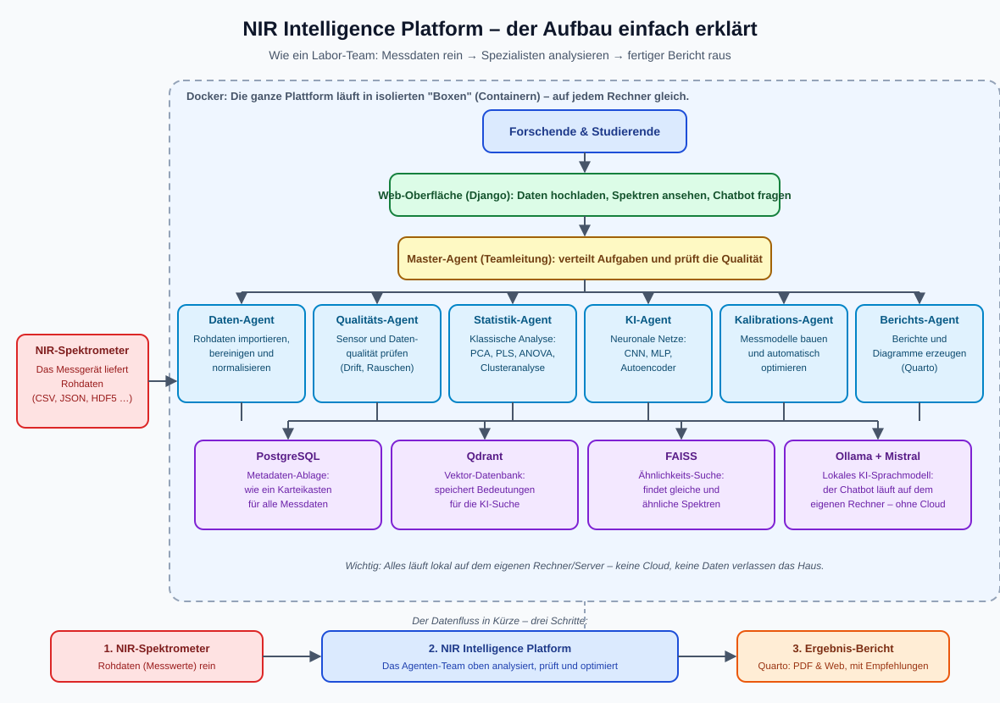

# Projektstruktur der NIR Intelligence Platform – einfach erklärt



*Abbildung 1: So ist die NIR Intelligence Platform aufgebaut – vom Spektrometer bis zum fertigen Bericht.*

## Das Wichtigste in einem Satz

Die NIR Intelligence Platform ist ein **Team aus KI-Agenten**, das Messdaten von Nahinfrarot-Spektrometern automatisch analysiert – wie ein Labor-Team aus Spezialisten, das Daten importiert, prüft, auswertet, Kalibrationen baut und am Ende einen fertigen Bericht liefert.

## Die drei Ebenen des Projekts

### 1. Steuerungsebene (Repo-Wurzel)

Diese Dateien steuern jede Arbeit am Projekt. Sie sagen der KI, was zu tun ist und welche Regeln gelten:

| Datei | Rolle (Laien-Sprache) |
|---|---|
| `AGENTS.md` | Hausordnung: Pflicht-Lektüre und Regeln für jede Session |
| `MISSION_STATEMENT.md` | Das Ziel des Projekts und die 15 Hauptaufgaben |
| `AGENT_FRAMEWORK_INIT_PROMPT.md` | Startprotokoll für KI-Agenten |
| `REPOSITORY_ALIGNMENT_AND_ROADMAP.md` | Entwicklungsplan (Schritte S1–S9) |
| `CLEANUP.md` | Aufräumaufgaben |

### 2. Die Plattform selbst (`NIR_Intelligence-main/`)

Das ist das Herzstück – hier lebt die eigentliche Software:

```
NIR_Intelligence-main/
├── agents/            Die KI-Spezialisten (eine Python-Datei pro Agent)
├── django_project/    Die Web-Oberfläche (Django): Seiten, API, Chatbot
├── docs/              Dokumentation (diese Datei liegt auch hier)
├── config/            Einstellungen für Agenten und Umgebung
├── data/raw|processed Eingangs- und verarbeitete Daten
├── services/          Hilfsdienste (z. B. Bildanzeige via napari)
├── scripts/           Start- und Utility-Skripte
├── tests/             Unit-, Integration- und E2E-Tests
├── ansible/           Automatische Installation auf Servern (Debian)
├── packaging/DEBIAN   Installation als Debian-Paket (.deb)
├── dev_framework/     Hilfsframework für Entwicklung & Tests
├── docker-compose.yml Startdefinition für alle Container
└── TASK.md, task_definition.yaml, system_manifest.json
                       Die drei Pflicht-Steuerdateien der Startsequenz
```

### 3. Das Laufzeit-Setup (Docker-Container)

Beim Start entstehen Docker-Container, die zusammenarbeiten:

- **PostgreSQL** – Karteikasten für Metadaten
- **Qdrant** – Vektor-Datenbank für KI-Suche
- **FAISS** – Ähnlichkeitssuche zwischen Spektren
- **Ollama + Mistral** – lokales Sprachmodell für den Chatbot
- **ILIAS** – E-Learning-Plattform für Studierende
- **Django** – die Web-Oberfläche

## Das Agenten-Team im Detail

An der Spitze steht der **Master-Agent** als Teamleitung. Er verteilt Aufgaben an spezialisierte Agenten und prüft deren Arbeit:

| Agent | Aufgabe (Laien-Sprache) |
|---|---|
| Data Preparation | Daten importieren, sauber machen, Ausreißer entfernen |
| Metadata | Metadaten erkennen und bewerten |
| Sensor Quality | Prüft, ob das Messgerät korrekt arbeitet (Drift, Rauschen) |
| Statistical Analysis | Klassische Mathematik: PCA, PLS, ANOVA, Cluster |
| Neural Network | KI-Modelle (CNN, MLP, Autoencoder) – läuft immer parallel zur Statistik |
| Calibration | Baut und optimiert Messmodelle (z. B. XGBoost, Random Forest) |
| Qdrant / FAISS / PostgreSQL | Speichern und suchen – Daten, Bedeutungen, Ähnlichkeiten |
| Django | Web-Oberfläche und Benutzerverwaltung |
| MCP | Bindeglied zu externen Werkzeugen |
| Quarto | Erzeugt den fertigen Bericht mit Diagrammen |
| Flower | Federated Learning: Modelle gemeinsam trainieren, ohne Daten zu teilen |

## Wie die Qualität gesichert wird

Die Plattform arbeitet in einer **Schleife**: analysieren → bewerten → optimieren → neu analysieren. Das wiederholt sie so lange, bis **keine Fehler, keine kritischen Warnungen und keine offenen Änderungswünsche** mehr vorhanden sind. Erst dann gilt ein Ergebnis als fertig.

## Rahmenbedingungen

- **Lokal**: Alle Daten bleiben auf dem eigenen Rechner/Server – keine Cloud.
- **Containerisiert**: Läuft überall identisch dank Docker.
- **Technologie-Stack**: Python 3.12/UV, Docker, Ollama (Mistral), CrewAI, Qdrant, FAISS, PostgreSQL, Django, Quarto, Flower.
