# Analyse der Tomaten-NIR-Daten (T4-T5) - Orange-Workflow als Skript

**Datenquelle:** `data/raw/T4-T5_ALLE_mit_Brix_2.txt` (2049 Messungen, 18 Kanaele, Geraet: Dpark fun NIR Triad)

## 1. Datenvorbereitung

- Rohdaten: **2049 Messungen** von 40 Tomaten, 18 Kanaele (410-940 nm)
- Entfernt: **31 ADC-Ueberlaeufe** (>= 2^31, Kanaele F_535/R_610) und **4 Null-Messungen** (I_645/K_900)
- Bereinigt: **2014 Messungen**; SNV-Normalisierung angewendet

## 2. Qualitaetsbewertung

- Rauschen (CV der Wiederholungen): **0.4061** (Schwelle 0.05)
- Drift (relativer Trend): **0.0000** (Schwelle 0.01)
- SNR: Median **2.4368**, Min **1.9603**
- Qualitaets-Score: **0.0000** (ROT)

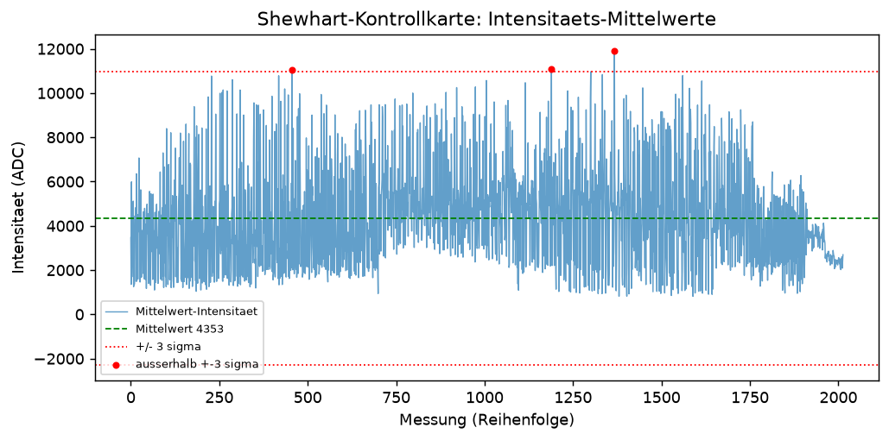

## 3. Spektralanalyse

- Korrelation mit Brix am staerksten: `G_560` (-0.614), `F_535` (-0.532), `E_510` (-0.463), `H_585` (-0.454), `D_485` (-0.415)

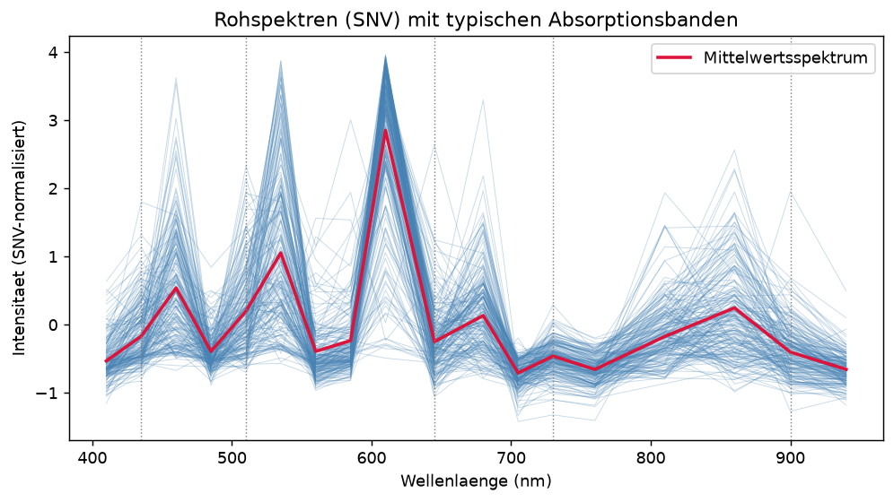

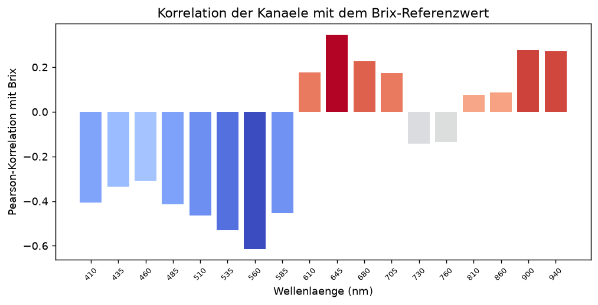

## 4. Statistische Analyse

- **PCA:** PC1 38.0%, PC2 25.9%, kumulativ (10 PCs) 97.0%
- **PLS (10 Komp., 5-fold CV):** R2 = 0.6215, RMSECV = 0.6234
- **Clustering (Ward):** bestes k = 2, Silhouette = 0.4483, Groessen = [1797, 217]
- **ANOVA (Cluster vs. Brix):** F = 91.2815, p = 3.48e-21

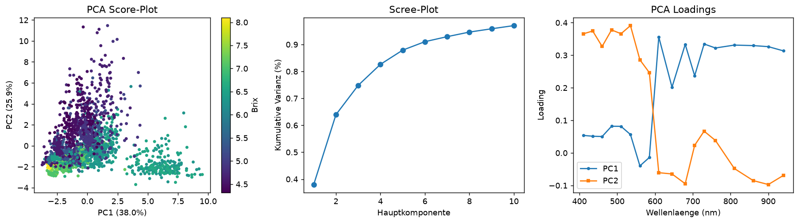

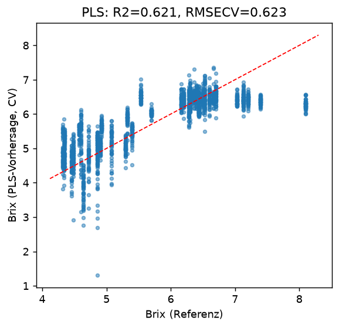

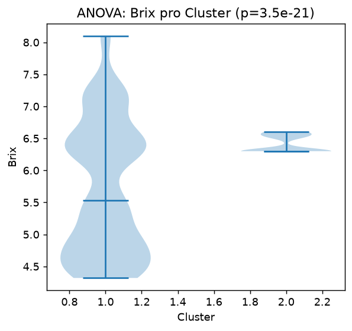

## 5. Neuronale Netze

- **MLP (64-32):** R2 = 0.8456, RMSE = 0.3982
- **CNN (1D):** R2 = 0.5873, RMSE = 0.6510
- **Autoencoder:** 101 Anomalien (95. Perzentil-Schwelle)
- **Bester Vorhersager:** **MLP** (R2 = 0.8456)

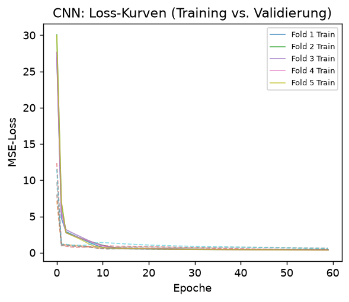

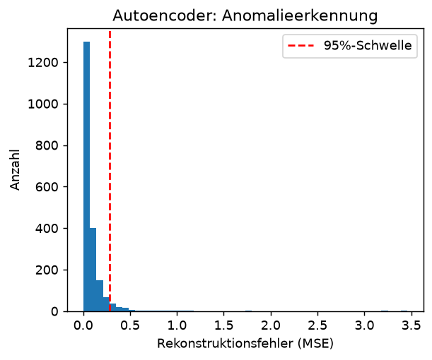

## 6. XAI

- Wichtigste Kanaele (Permutation, SHAP-analog): `G_560` (0.5209), `U_760` (0.3387), `W_860` (0.2231), `J_705` (0.1645), `V_810` (0.0531)

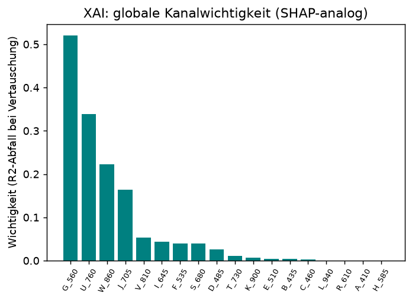

## 7. Kalibrierung

- **PLS:** beste Komponentenzahl 9, RMSECV = 0.6231
- **PCR:** beste Komponentenzahl 10, RMSECV = 0.6354

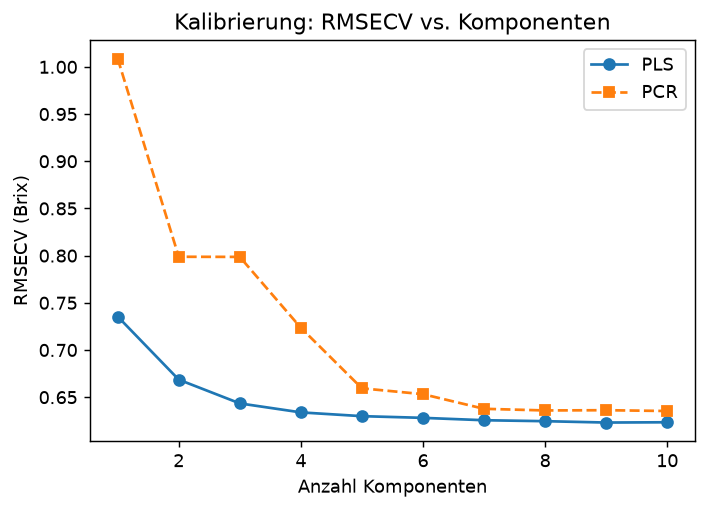

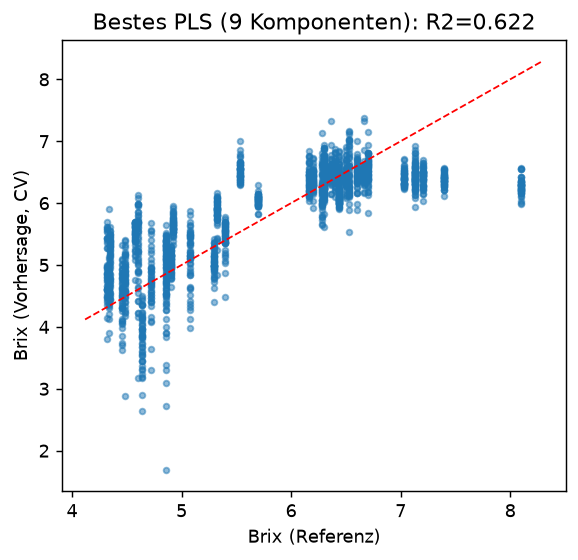

## 8. FAISS-Datenbankvergleich

- Index: 2014 Spektren; Top-3 zur Abfrage `10401T5`: `30301T5` (D=0.406), `10301T5` (D=0.545), `30301T5` (D=0.551)

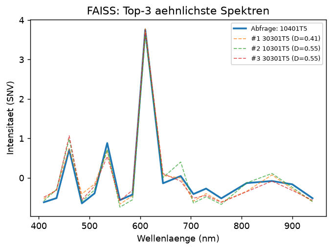

## 9. Warnungen & Empfehlungen

- ⚠️ Rauschen 0.4061 > Schwelle 0.05: Messzeit erhoehen, um SNR zu verbessern
- Empfehlung: PLS mit 9 Komponenten als Kalibrierungsmodell (RMSECV 0.6231 Brix).
- Empfehlung: Verstaerkung/Belichtung an F_535 und R_610 reduzieren (Ueberlaeufe).
- Empfehlung: Mehr Wiederholungen je Tomate mitteln, um SNR zu verbessern.

## Gesamtuebersicht

| Kennzahl | Wert |
|---|---|
| Datensaetze (roh / bereinigt) | 2049 / 2014 |
| Qualitaets-Score | 0.0000 (ROT) |
| Brix-Bereich | 4.32 - 8.10 |
| Bestes Modell | MLP (R2 0.8456) |
| Beste Kalibrierung | PLS, 9 Komponenten, RMSECV 0.6231 |