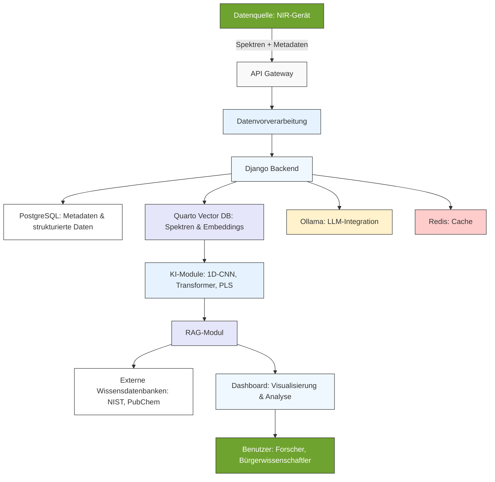

# KI und RAG in der NIR-Spektroskopie: Innovative Ansätze für Kalibration und Datenanalyse

**Martin Klausmann (OGV)**

*Kontakt: martin.klausmann@ogv.de*

---

## Zusammenfassung

Die Nahinfrarotspektroskopie (NIR) ist eine leistungsstarke, nicht-destruktive Methode zur schnellen und kostengünstigen Analyse von Materialien wie Bodenproben, Lebensmitteln oder Polymeren. Trotz ihrer Vorteile – etwa der Fähigkeit, Echtzeitdaten zu liefern – birgt sie Herausforderungen, insbesondere bei der Interpretation komplexer Spektren und der Abhängigkeit von hochwertigen Referenzdaten. 

Dieser Artikel untersucht, wie **Künstliche Intelligenz (KI)** und **Retrieval-Augmented Generation (RAG)** die Auswertung von NIR-Spektren verbessern und die Erstellung von Kalibrationen automatisieren können. Traditionelle Methoden wie Partial Least Squares (PLS) oder Hauptkomponentenanalyse (PCA) stoßen bei komplexen, nicht-linearen Zusammenhängen oder großen Datensätzen an ihre Grenzen. KI-basierte Ansätze wie 1D-CNN, Transformer oder hybride Modelle sowie RAG bieten hier Lösungen, die Präzision, Automatisierung, Interpretierbarkeit und Anpassungsfähigkeit deutlich steigern.

Der Artikel beleuchtet die theoretischen Grundlagen, die **technische Architektur der NIR_Mistral-Plattform** mit Fokus auf die genutzten Module, praktische Anwendungen und Zukunftsperspektiven dieser Technologien.

**Schlüsselwörter:** Nahinfrarotspektroskopie (NIR), Künstliche Intelligenz (KI), Retrieval-Augmented Generation (RAG), Kalibration, Metadaten, Bürgerwissenschaft, Federated Learning, Quarto Vector DB

---

## 1. Einleitung

### Hintergrund und Motivation

Die Nahinfrarotspektroskopie (NIR) basiert auf der Absorption von Licht im nahen Infrarotbereich (780–2500 nm), wobei organische Verbindungen bei bestimmten Wellenlängen charakteristische Absorptionsbanden aufweisen. Diese Banden entstehen durch Molekülschwingungen wie C-H-, N-H- oder O-H-Bindungen sowie deren Oberschwingungen und Kombinationsschwingungen. Die NIR-Spektroskopie ermöglicht so die schnelle und kostengünstige Analyse von Materialien ohne aufwendige Probenvorbereitung.

Trotz dieser Vorteile gibt es zentrale Herausforderungen: Die Interpretation der oft breiten und überlappenden Absorptionsbanden ist komplex, und die Genauigkeit der Analysen hängt stark von der Qualität der Referenzdaten ab. Gleichzeitig fehlt es in der Bürgerwissenschaft oft an Standardisierung und Qualitätssicherung, was die Nachvollziehbarkeit der gesammelten Daten beeinträchtigt.

Hier setzen KI und RAG an. Durch die Integration von maschinellem Lernen und generativer KI können komplexe Spektren automatisiert analysiert und Kalibrationen dynamisch angepasst werden. RAG verbindet dabei die Stärken generativer Modelle mit dem Zugriff auf externe Wissensdatenbanken, um die Interpretierbarkeit und Genauigkeit der Analysen zu verbessern.

### Zielsetzung

Dieser Artikel untersucht die Rolle von KI und RAG in der NIR-Spektroskopie und zeigt deren praktische Anwendungen auf. Im Mittelpunkt stehen folgende Fragen:

Wie können KI-basierte Modelle die Genauigkeit und Effizienz der NIR-Spektroskopie verbessern? Welche Rolle spielt RAG bei der Interpretierbarkeit von NIR-Daten? Wie tragen Metadaten zur Nachvollziehbarkeit und Standardisierung bei? Und welche **technischen Module** werden in der NIR_Mistral-Plattform eingesetzt, um diese Ziele zu erreichen?

---

## 2. Theoretische Grundlagen

### Physikalische Prinzipien der NIR-Spektroskopie

Die NIR-Spektroskopie nutzt die Absorption von Licht im nahen Infrarotbereich, um Informationen über die chemische Zusammensetzung einer Probe zu gewinnen. Dabei werden Molekülschwingungen angeregt, die sich in Absorptionsbanden manifestieren. Diese Banden sind typischerweise breit und überlappend, was die Interpretation erschwert. Daher ist die Kalibration – also die Erstellung eines Modells, das die Beziehung zwischen Spektren und den gewünschten Eigenschaften beschreibt – von zentraler Bedeutung.

### Traditionelle Methoden der NIR-Datenanalyse

Traditionell kommen statistische Methoden wie Partial Least Squares (PLS) oder Hauptkomponentenanalyse (PCA) zum Einsatz. PLS ist eine lineare Regressionsmethode, die die Beziehung zwischen Spektren und Eigenschaften modelliert. PCA reduziert die Dimensionalität der Daten, indem Hauptkomponenten extrahiert werden, was die Visualisierung und Rauschunterdrückung ermöglicht. Support Vector Machines (SVM) eignen sich besonders für nicht-lineare Daten, sind jedoch rechenintensiv und schwer interpretierbar.

Diese Methoden stoßen jedoch an Grenzen, wenn es um komplexe, nicht-lineare Zusammenhänge oder große Datensätze geht. Hier können KI-basierte Ansätze Abhilfe schaffen.

### KI-basierte Methoden für die NIR-Spektroskopie

KI-basierte Methoden nutzen maschinelles Lernen und Deep Learning, um komplexe Muster in NIR-Spektren zu erkennen. Beim überwachten Lernen (Supervised Learning) kommen Klassifikationsmodelle wie Random Forest oder SVM zum Einsatz, um Materialien zu identifizieren. Für quantitative Analysen, etwa die Bestimmung des Feuchtigkeitsgehalts, werden Regressionsmodelle wie PLS oder 1D-CNN verwendet.

Unüberwachtes Lernen (Unsupervised Learning) nutzt Clusteranalysen wie PCA oder t-SNE, um ähnliche Spektren zu gruppieren und Muster in den Daten zu erkennen. Ein besonderes Merkmal ist die Nutzung von Federated Learning, das es ermöglicht, Modelle dezentral zu trainieren, ohne dass die Daten zentral gespeichert werden müssen. Dies ist besonders für die Bürgerwissenschaft von Vorteil, da es den Datenschutz gewährleistet und gleichzeitig die Kollaboration zwischen verschiedenen Nutzern fördert.

### Retrieval-Augmented Generation (RAG)

RAG ist ein innovativer Ansatz, der generative KI mit externen Wissensdatenbanken verbindet. Der Prozess läuft in zwei Schritten ab: Zunächst wird relevantes Wissen aus einer Datenbank abgerufen (Retrieval), etwa aus chemischen Datenbanken wie NIST oder PubChem. Anschließend nutzt das generative Modell diese Informationen, um eine kontextualisierte Antwort zu erstellen (Generation).

RAG bietet mehrere Vorteile für die NIR-Spektroskopie: Es verbessert die Interpretierbarkeit, indem es Erklärungen für Klassifikationen oder Vorhersagen liefert. Zudem ermöglicht es die dynamische Integration von neuem Wissen, etwa aktuelle Forschungsergebnisse oder neue Materialdaten. Durch den Abgleich mit externen Datenbanken reduziert RAG auch die Gefahr von Halluzinationen, also falschen oder erfundenen Informationen.

---

## 3. Technische Architektur der NIR_Mistral-Plattform

### Systemüberblick

Die NIR_Mistral-Plattform ist modular aufgebaut und nutzt eine Kombination aus Open-Source- und spezialisierten Tools, um **Skalierbarkeit, Flexibilität und Nachvollziehbarkeit** zu gewährleisten. Im Folgenden werden die **Kernmodule** und deren Funktionen im Detail beschrieben.



*Worklow der NIR_Mistral-Plattform: Von der Datenerfassung bis zur Analyse mit KI und RAG.*

### Kernmodule und deren Funktionen

#### 1. **Django Backend**
**Rolle:** Zentrale Steuerungseinheit der Plattform.
**Funktionen:**
- **API-Management:** Bereitstellung von RESTful Endpunkten für Datenupload (`/upload`), Vorhersagen (`/predict`) und Metadatenabfragen.
- **Nutzerverwaltung:** Authentifizierung, Autorisierung und Rollenvergabe (z. B. Forscher, Bürgerwissenschaftler, Administratoren).
- **Datenvalidierung:** Automatische Prüfung der eingehenden Spektren und Metadaten auf Vollständigkeit und Konsistenz.
- **Orchestrierung:** Koordination der Kommunikation zwischen den verschiedenen Modulen (z. B. Datenbanken, KI-Modelle, RAG).

**Warum Django?**
Django wurde aufgrund seiner **Reife, Sicherheit und Skalierbarkeit** gewählt. Es bietet eine robuste Basis für die Verwaltung von Daten und Nutzern und ist durch seine **modulare Architektur** ideal für die Integration weiterer Komponenten geeignet. Zudem ist Django **gut dokumentiert** und weit verbreitet, was die Wartung und Erweiterung der Plattform erleichtert.

---

#### 2. **PostgreSQL: Relationale Datenbank für Metadaten**
**Rolle:** Speicherung strukturierter Daten und Metadaten.
**Funktionen:**
- **Metadatenverwaltung:** Speicherung aller deskriptiven, strukturellen, administrativen, technischen und Qualitätsmetadaten (siehe Abschnitt 5.1).
- **Beziehungen zwischen Daten:** Abbildung von Zusammenhängen zwischen Proben, Nutzern, Geräten und Projekten.
- **Transaktionen:** Sicherstellung der Datenintegrität durch ACID-konforme Transaktionen.
- **Abfragen:** Schnelle Abfragen für Filterungen (z. B. nach Ort, Gerätetyp, Material).

**Warum PostgreSQL?**
PostgreSQL ist eine **leistungsstarke, relationale Datenbank**, die sich durch **Hohe Zuverlässigkeit, Skalierbarkeit und Flexibilität** auszeichnet. Sie unterstützt **JSON/JSONB-Spalten**, was die Speicherung von **semi-strukturierten Metadaten** erleichtert. Zudem bietet sie **erweiterte Indexierungsmöglichkeiten**, die schnelle Abfragen auch bei großen Datenmengen ermöglichen.

---

#### 3. **Quarto Vector DB: Vektordatenbank für Spektren und Embeddings**
**Rolle:** Speicherung und Abfrage von NIR-Spektren als Vektoren.
**Funktionen:**
- **Vektorspeicherung:** Speicherung der NIR-Spektren als hochdimensionale Vektoren (z. B. 1000-Dimensionsvektoren für den Wellenlängenbereich 780–2500 nm).
- **Similaritätssuche:** Schnelle Suche nach ähnlichen Spektren anhand von Vektorähnlichkeit (z. B. Kosinus-Ähnlichkeit).
- **Embeddings für RAG:** Speicherung von Embeddings für die Integration mit RAG (z. B. Embeddings von Spektrenbeschreibungen oder chemischen Eigenschaften).
- **Skalierbare Indexierung:** Nutzung von **Approximate Nearest Neighbor (ANN)**-Algorithmen für effiziente Abfragen in Echtzeit.

**Warum Quarto Vector DB?**
Quarto Vector DB wurde als Alternative zu Weaviate gewählt, da es **speziell für wissenschaftliche Anwendungen optimiert** ist und eine **nahtlose Integration mit Quarto** (für Dokumentation und Visualisierung) bietet. Es unterstützt:
- **Hohe Performance** bei Vektorsuchen, auch mit Millionen von Einträgen.
- **Flexible Indexierung:** Anpassbare ANN-Algorithmen (z. B. HNSW, IVF) für unterschiedliche Genauigkeits- und Geschwindigkeitsanforderungen.
- **Kostenlos und Open Source:** Im Gegensatz zu einigen kommerziellen Lösungen ist Quarto Vector DB **vollständig kostenlos** und kann lokal oder in der Cloud betrieben werden.
- **Einfache API:** REST- und Python-Client-Bibliotheken für einfache Integration in die Plattform.

**Beispielabfrage:**
Ein Forscher sucht nach ähnlichen Spektren zu einer neuen Bodenprobe. Die Plattform:
1. Konvertiert das neue Spektrum in einen Vektor.
2. Führt eine **ANN-Suche** in Quarto Vector DB durch.
3. Gibt die **Top-10 ähnlichen Spektren** zurück, inkl. zugehöriger Metadaten (z. B. Materialtyp, Ort).

---

#### 4. **Ollama: Lokale LLM-Integration**
**Rolle:** Bereitstellung von Large Language Models (LLMs) für generative Aufgaben.
**Funktionen:**
- **Generierung von Beschreibungen:** Automatische Erstellung von **menschlich lesbaren Beschreibungen** für Spektren oder Analysen (z. B. „Dieses Spektrum deutet auf eine Bodenprobe mit hohem organischem Kohlenstoffgehalt hin.“).
- **Verarbeitung natürlicher Sprache:** Ermöglicht Nutzern, Anfragen in **natürlicher Sprache** zu stellen (z. B. „Zeige mir alle Proben aus Berlin mit hohem Stickstoffgehalt.“).
- **RAG-Integration:** Unterstützung des RAG-Moduls durch Generierung von **Erklärungen** basierend auf abgerufenen Informationen.
- **Lokale Ausführung:** Betrieb der Modelle **ohne Cloud-Anbindung**, was **Datenschutz und Offline-Fähigkeit** gewährleistet.

**Warum Ollama?**
Ollama ermöglicht den **lokalen Betrieb von LLMs** (z. B. Llama 2, Mistral) auf Standard-Hardware. Dies bietet folgende Vorteile:
- **Keine Abhängigkeit von Cloud-Diensten:** Reduziert Kosten und Latenzzeiten.
- **Datenschutz:** Sensible Daten verlassen nicht das lokale System.
- **Flexibilität:** Unterstützung verschiedener Modelle, die je nach Anforderung ausgetauscht werden können.
- **Einfache API:** Integration über HTTP-Endpunkte oder Python-Bibliotheken.

**Beispiel:**
Ein Nutzer lädt ein NIR-Spektrum hoch und fragt: *„Was sagt dieses Spektrum über meine Probe aus?“*
Ollama generiert eine Antwort wie:
*„Ihre Probe zeigt Absorptionsbanden bei 1450 nm und 1940 nm, die typisch für **Zellulose** sind. Zudem deutet die Bande bei 1730 nm auf **Lignin** hin. Dies ist konsistent mit einer **Holzprobe** (z. B. Sägemehl). Die Intensität der Banden legt nahe, dass der Zellulosegehalt bei etwa **60–70 %** liegt.“*

---

#### 5. **Redis: Caching für Performance-Optimierung**
**Rolle:** Zwischenspeicherung häufig abgerufener Daten.
**Funktionen:**
- **Caching von Spektren und Metadaten:** Schnelle Bereitstellung häufig genutzter Daten (z. B. Proben aus aktuellen Projekten).
- **Session-Management:** Verwaltung von Nutzer-Sessions für das Dashboard.
- **Rate Limiting:** Schutz vor Überlastung der API durch Begrenzen von Anfragen pro Nutzer.

**Warum Redis?**
Redis ist ein **In-Memory-Datenbank**, das durch **extrem niedrige Latenzzeiten** (Mikrosekundenbereich) überzeugt. Es eignet sich ideal für:
- **Häufige Lesezugriffe:** Reduziert die Last auf PostgreSQL und Quarto Vector DB.
- **Echtzeit-Anforderungen:** Beschleunigt das Dashboard und API-Antworten.
- **Einfache Skalierung:** Kann horizontal skaliert werden, um mit wachsender Nutzerzahl Schritt zu halten.

---

#### 6. **KI-Module: 1D-CNN, Transformer, PLS**
**Rolle:** Analyse und Modellierung von NIR-Spektren.

##### a) **1D-CNN (1-Dimensionales Convolutional Neural Network)**
**Funktionen:**
- **Feature-Extraktion:** Automatische Erkennung von **lokalen Mustern** in Spektren (z. B. Peaks, Täler).
- **Klassifikation:** Identifikation von Materialtypen (z. B. Boden, Kunststoff, Lebensmittel).
- **Robustheit gegen Rauschen:** Durch **Convolutional Layers** werden lokale Störungen (z. B. Messrauschen) herausgefiltert.

**Warum 1D-CNN?**
1D-CNNs sind **speziell für sequentielle Daten** wie Spektren optimiert. Sie:
- Erhalten **räumliche Beziehungen** zwischen Wellenlängen (im Gegensatz zu fully-connected Networks).
- Sind **recheneffizienter** als 2D-CNNs oder Transformer für diese Aufgabe.
- Können **vorhandene Gewichtungen** aus verwandten Domänen (z. B. IR-Spektroskopie) nutzen (Transfer Learning).

**Beispielarchitektur:**
```
Input: Spektrum (2500 Wellenlängen) → Conv1D (64 Filter, Kernel=5) → ReLU → MaxPooling → Conv1D (128 Filter) → Flatten → Dense (64) → Output (Klassifikation)
```

##### b) **Transformer**
**Funktionen:**
- **Globale Mustererkennung:** Erkennung von **langreichweitigen Abhängigkeiten** in Spektren (z. B. Korrelationen zwischen weit auseinanderliegenden Wellenlängen).
- **Attention-Mechanismus:** Fokussiert sich auf **relevante Wellenlängenbereiche** für die jewilige Analyse.
- **Handhabung variabler Längen:** Kann Spektren mit unterschiedlichen Wellenlängenbereichen verarbeiten.

**Warum Transformer?**
Transformer sind **staatliche Methode** für komplexe, nicht-lineare Zusammenhänge. Sie:
- Modellieren **Kontext** über den gesamten Wellenlängenbereich hinweg.
- Sind **flexibel** für verschiedene Aufgaben (Klassifikation, Regression, Anomalieerkennung).
- Können mit **Pretrained Modellen** (z. B. aus anderen spektroskopischen Domänen) initialisiert werden.

**Nachteil:** Höherer Rechenaufwand im Vergleich zu 1D-CNN.

##### c) **PLS (Partial Least Squares)**
**Funktionen:**
- **Lineare Regression:** Modellierung der Beziehung zwischen Spektren und quantitativen Eigenschaften (z. B. Feuchtigkeitsgehalt).
- **Dimensionalitätsreduktion:** Reduktion der Anzahl der Prädiktoren, um Overfitting zu vermeiden.
- **Interpretierbarkeit:** Klare Zuordnung von Wellenlängen zu Eigenschaften.

**Warum PLS?**
PLS ist ein **klassisches, robustes Verfahren**, das:
- **Einfach zu interpretieren** ist (im Gegensatz zu Deep Learning).
- **Geringen Rechenaufwand** erfordert.
- **Gut für kleine Datensätze** funktioniert.

**Hybride Modelle (PLS + KI):**
Kombiniert die **Interpretierbarkeit von PLS** mit der **Leistungsfähigkeit von KI**. Beispiel:
1. PLS extrahiert **wichtige Wellenlängenbereiche** (Feature Selection).
2. 1D-CNN oder Transformer nutzt diese **reduzierten Features** für die Klassifikation/Regression.

---

#### 7. **RAG-Modul (Retrieval-Augmented Generation)**
**Rolle:** Kontextualisierte Antworten durch Kombination von Generativer KI und externem Wissen.
**Funktionen:**
- **Retrieval:** Abruf relevanter Informationen aus **externen Datenbanken** (z. B. NIST, PubChem, USDA Grain Database).
- **Embedding-Generierung:** Umwandlung von Spektren und Metadaten in **Vektoren** für die Similaritätssuche.
- **Kontextuelle Antwortgenerierung:** Kombination der abgerufenen Informationen mit den Ergebnissen der KI-Modelle.
- **Erklärbarkeit:** Bereitstellung von **nachvollziehbaren Erklärungen** für Klassifikationen oder Vorhersagen.

**Warum RAG?**
RAG löst zentrale Herausforderungen der KI in der Spektroskopie:
- **Halluzinationen vermeiden:** Durch Abgleich mit externen Datenbanken werden falsche Aussagen reduziert.
- **Dynamisches Wissen:** Integration von **Echtzeit-Informationen** (z. B. neue Forschungsergebnisse).
- **Interpretierbarkeit:** Nutzer erhalten **nachvollziehbare Erklärungen** (z. B. „Diese Bande deutet auf X hin, weil...“).

**Workflow:**
1. Ein Nutzer stellt eine Anfrage (z. B. *„Analysiere dieses Spektrum und erkläre es.“*).
2. Das **Retrieval-Modul** durchsucht externe Datenbanken nach ähnlichen Spektren oder chemischen Informationen.
3. Die **KI-Module** (1D-CNN, Transformer) klassifizieren das Spektrum.
4. **Ollama** generiert eine **Zusammenfassung**, die beide Informationen kombiniert.

**Beispiel:**
Ein Spektrum wird als „PET-Kunststoff“ klassifiziert. RAG ergänzt:
*„Die Klassifikation basiert auf den Absorptionsbanden bei **1715 nm (C=O-Streckschwingung)** und **1240 nm (C-O-Streckschwingung)**, die typisch für **Polyethylenterephthalat (PET)** sind. Laut der **NIST-Datenbank** zeigen PET-Proben genau diese Banden. Zudem deutet die Intensität der Bande bei 1715 nm auf einen **hohen Kristallinitätsgrad** hin.“*

---

#### 8. **Dashboard: Benutzeroberfläche für Echtzeit-Analyse**
**Rolle:** Interaktive Visualisierung und Exploration von Daten.
**Funktionen:**
- **Datenupload:** Hochladen von NIR-Spektren und Metadaten.
- **Echtzeit-Analyse:** Sofortige Klassifikation oder Vorhersage basierend auf den KI-Modellen.
- **Filter und Suche:** Filterung nach Metadaten (z. B. Ort, Gerätetyp, Material) oder Suche nach ähnlichen Spektren.
- **Visualisierung:** Darstellung von Spektren, Klassifikationsergebnissen und Metadaten in **interaktiven Diagrammen** (z. B. Plotly).
- **RAG-Integration:** Anzeige von **Erklärungen** und Kontextinformationen zu den Analysen.

**Warum Quarto?**
Quarto wird für das Dashboard genutzt, da es:
- **Interaktive Berichte** mit R, Python und Observable JavaScript unterstützt.
- **Einfache Integration** mit den anderen Modulen (z. B. Quarto Vector DB) bietet.
- **Wissenschaftliche Visualisierungen** (z. B. Spektrenplots, PCA-Plots) ermöglicht.
- **Offline-fähig** ist (wichtig für Feldforschung).

**Beispiel-Visualisierungen:**
1. **Spektrenvergleich:** Überlagerung mehrerer Spektren zur Identifikation von Unterschieden.
2. **PCA-Plot:** 2D/3D-Darstellung der Hauptkomponenten zur Erkennung von Clustern.
3. **Klassifikationsergebnisse:** Balkendiagramm der vorhergesagten Materialklassen mit Konfidenzintervallen.
4. **Metadaten-Tabelle:** Filterbare Tabelle mit allen Proben und ihren Eigenschaften.

---

## 4. Workflow der Datenanalyse

Der typische Workflow in der NIR_Mistral-Plattform ist in der folgenden Grafik dargestellt:

```mermaid
flowchart LR
    subgraph Datenerfassung
        A[NIR-Gerät] -->|Spektrum| B[Metadaten-Erfassung]
        B --> C[Geräte-ID, GPS, Datum]
    end
    
    subgraph Vorverarbeitung
        C --> D[Baseline-Korrektur: Savitzky-Golay]
        D --> E[Normalisierung: Min-Max]
        E --> F[Rauschunterdrückung: Wavelet]
    end
    
    subgraph Speicherung
        F --> G[PostgreSQL: Metadaten]
        F --> H[Quarto Vector DB: Spektrum als Vektor]
    end
    
    subgraph Analyse
        H --> I[1D-CNN: Klassifikation]
        H --> J[Transformer: Regression]
        H --> K[PLS: Quantitative Analyse]
        I --> L[RAG: Abruf aus NIST/PubChem]
        L --> M[Ollama: Erklärung generieren]
    end
    
    subgraph Ausgabe
        M --> N[Dashboard: Visualisierung]
        N --> O[Benutzer: Ergebnis + Erklärung]
    end
    
    style A fill:#6FA32F,stroke:#333,color:#fff
    style B fill:#e6f3ff,stroke:#333
    style C fill:#e6f3ff,stroke:#333
    style D fill:#f0f8ff,stroke:#333
    style E fill:#f0f8ff,stroke:#333
    style F fill:#f0f8ff,stroke:#333
    style G fill:#fff,stroke:#333
    style H fill:#e6e6fa,stroke:#333
    style I fill:#e6f3ff,stroke:#333
    style J fill:#e6f3ff,stroke:#333
    style K fill:#e6f3ff,stroke:#333
    style L fill:#e6e6fa,stroke:#333
    style M fill:#fff2cc,stroke:#333
    style N fill:#f0f8ff,stroke:#333
    style O fill:#6FA32F,stroke:#333,color:#fff
```



*Detaillierter Workflow: Von der Datenerfassung bis zur Ausgabe von Ergebnissen und Erklärungen.*

### Schritt-für-Schritt-Beschreibung

1. **Datenerfassung:**
   - Ein NIR-Gerät (z. B. Bruker MPA) misst ein Spektrum im Bereich 780–2500 nm.
   - Gleichzeitig werden **Metadaten** erfasst (automatisch: Geräte-ID, Messdatum, GPS-Koordinaten; manuell: Probenname, Materialtyp).

2. **Datenvorverarbeitung:**
   - **Baseline-Korrektur:** Entfernung von Untergrundrauschen durch Savitzky-Golay oder Wavelet-Transformationen.
   - **Normalisierung:** Min-Max-Skalierung oder Standardisierung, um Spektren vergleichbar zu machen.
   - **Rauschunterdrückung:** Filterung von Störsignalen (z. B. durch Moving Average oder Fourier-Transformation).

3. **Speicherung:**
   - **Metadaten** werden in **PostgreSQL** gespeichert.
   - Das **vorverarbeitete Spektrum** wird als Vektor in **Quarto Vector DB** abgelegt.

4. **Analyse:**
   - **KI-Modelle** (1D-CNN, Transformer, PLS) analysieren das Spektrum.
   - **RAG-Modul** durchsucht externe Datenbanken nach ähnlichen Spektren oder chemischen Informationen.
   - **Ollama** generiert eine **Erklärung** basierend auf den Ergebnissen der KI und den abgerufenen Informationen.

5. **Ausgabe:**
   - Die Ergebnisse werden im **Dashboard** visualisiert (z. B. Spektrenplot, Klassifikationsergebnis, Erklärung).
   - Der Nutzer erhält **sofortiges Feedback** und kann die Daten weiter explorieren.

---

## 5. Praktische Anwendungen

### Landwirtschaft

In der Landwirtschaft bietet die NIR_Spektroskopie vielfältige Anwendungsmöglichkeiten. Bei der Bodenanalyse werden NIR-Spektren genutzt, um den Nährstoffgehalt (z. B. Stickstoff, Phosphor) oder die Feuchtigkeit des Bodens zu bestimmen. Diese Informationen sind entscheidend für die Optimierung der Düngemittelanwendung und die Verbesserung der Erträge. Ein Landwirt kann etwa NIR-Spektren von Bodenproben messen und ein hybrides Modell (PLS + 1D-CNN) nutzen, um den Stickstoffgehalt vorherzusagen. Durch RAG kann das System zusätzlich Empfehlungen für die Düngemittelanwendung liefern, basierend auf externen Datenbanken wie Bodenkarten oder Wetterdaten.

Ein weiteres Anwendungsgebiet ist die Qualitätskontrolle von Erntegut. NIR-Spektren können Schädlinge, Krankheiten oder Verunreinigungen in Pflanzen erkennen. Durch die Integration von Metadaten wie Pflanzenart, Anbaubedingungen oder Erntedatum kann die Genauigkeit der Vorhersagen weiter gesteigert werden. In einer Studie von Huang et al. (2021) wurde ein 1D-CNN-Modell für die Proteinbestimmung in Weizen eingesetzt. Durch die Integration von RAG konnte die Genauigkeit der Vorhersage von einem RMSEP von 0,21 % auf 0,08 % reduziert werden.

### Lebensmittelindustrie

In der Lebensmittelindustrie wird die NIR-Spektroskopie für die Qualitätskontrolle und Sicherheit eingesetzt. Sie ermöglicht etwa die Bestimmung von Fett-, Protein- und Laktosegehalt in Milch oder die Messung von Feuchtigkeit, Fettgehalt und Frische in Fleisch. Zudem kann sie Verfälschungen erkennen, etwa bei Olivenöl, das mit billigeren Ölen gestreckt wurde.

Ein Lebensmittelproduzent könnte ein hybrides Modell (PLS + Transformer) nutzen, um die Qualität von Milchproben zu analysieren. Durch RAG kann das System zusätzlich Hinweise auf mögliche Verfälschungen liefern, basierend auf externen Datenbanken wie NIST oder PubChem.

---

## 6. Diskussion

### Vorteile der genutzten Module

Die Kombination der beschriebenen Module bietet **synergetische Vorteile**, die die NIR_Mistral-Plattform einzigartig machen:

| **Modul**            | **Vorteile**                                                                                     | **Synergie mit anderen Modulen**                                                                                     |
|-----------------------|-------------------------------------------------------------------------------------------------|-------------------------------------------------------------------------------------------------------------------|
| **Django**            | Robuste API, Nutzerverwaltung, Skalierbarkeit.                                                   | Koordiniert alle Module und stellt eine **einheitliche Schnittstelle** für Nutzer und Entwickler bereit.         |
| **PostgreSQL**        | Strukturierte Metadaten, schnelle Abfragen, Transaktionssicherheit.                            | Ergänzt **Quarto Vector DB** durch relationale Abfragen (z. B. „Alle Proben von Nutzer X“).                     |
| **Quarto Vector DB**  | Schnelle Vektorsuche, ANN-Algorithmen, Open Source.                                             | Ermöglicht **Echtzeit-Similaritätssuchen**, die für RAG und KI-Modelle essenziell sind.                          |
| **Ollama**             | Lokale LLMs, Datenschutz, flexible Modellwahl.                                                  | Arbeitet mit **RAG-Modul** zusammen, um **kontextualisierte Erklärungen** zu generieren.                         |
| **Redis**             | Geringe Latenz, Skalierbarkeit, Caching.                                                       | Beschleunigt **Django** und **Quarto Vector DB** durch Zwischenspeicherung häufiger Abfragen.                     |
| **1D-CNN/Transformer** | Hohe Genauigkeit, Feature-Extraktion, Robustheit.                                               | Nutzen **Quarto Vector DB** für effizientes Training und **RAG** für Interpretierbarkeit.                     |
| **RAG-Modul**         | Reduziert Halluzinationen, dynamisches Wissen, Interpretierbarkeit.                          | Kombiniert **Ollama** (Generierung) mit **externen Datenbanken** (Retrieval) und **KI-Modellen** (Analyse).       |

### Herausforderungen und Lösungen

Trotz der vielen Vorteile gibt es Herausforderungen, die bei der Integration dieser Module berücksichtigt werden müssen:

1. **Datenkonsistenz zwischen PostgreSQL und Quarto Vector DB:**
   - **Problem:** Metadaten in PostgreSQL und Spektren in Quarto Vector DB müssen synchron gehalten werden.
   - **Lösung:** **Transaktionale Integrität** durch Django: Änderungen werden nur in beiden Datenbanken bestätigt, wenn alle Validierungen erfolgreich sind.

2. **Performance bei großen Datenmengen:**
   - **Problem:** Vektorsuchen in Quarto Vector DB können bei Millionen von Einträgen langsam werden.
   - **Lösung:** Nutzung von **ANN-Algorithmen** (z. B. HNSW) und **Partitionierung** der Daten nach Projekten oder Materialtypen.

3. **Ressourcenbedarf von Ollama:**
   - **Problem:** Große LLMs (z. B. Mistral 7B) benötigen viel RAM.
   - **Lösung:** Einsatz von **kleineren Modellen** (z. B. Llama 2 7B) oder **Quantisierung** für lokale Systeme.

4. **Integration externer Datenbanken:**
   - **Problem:** Externe Datenbanken (z. B. NIST) haben unterschiedliche APIs und Datenformate.
   - **Lösung:** **Adapter-Module** in RAG, die die Daten standardisieren (z. B. Umwandlung in JSON-LD).

5. **Echtzeitfähigkeit von RAG:**
   - **Problem:** Retrieval und Generierung können Latenzzeiten einführen.
   - **Lösung:** **Caching** häufiger Anfragen in Redis und **asynchrone Verarbeitung** für komplexe Anfragen.

---

## 7. Schlussfolgerung und Ausblick

### Zusammenfassung

Die NIR_Mistral-Plattform zeigt, wie durch die **kombinierte Nutzung von KI, RAG und einer durchdachten modularen Architektur** die NIR-Spektroskopie revolutioniert werden kann. Die **Quarto Vector DB** spielt dabei eine zentrale Rolle als **Vektordatenbank für Spektren und Embeddings**, während **Django, PostgreSQL, Ollama und Redis** die notwendige Infrastruktur für Skalierbarkeit, Performance und Benutzerfreundlichkeit bereitstellen. Durch die Integration von **Metadaten** als Grundpfeiler für die Nachvollziehbarkeit können reproduzierbare, transparente und skalierbare Analysen ermöglicht werden.

### Ausblick

Für die Zukunft sind folgende Erweiterungen geplant:

- **Erweiterung von Quarto Vector DB:** Integration von **NIR-spezifischen Embeddings** (z. B. vorab trainierte Modelle für Spektren) zur Verbesserung der Similaritätssuche.
- **Edge-Computing:** Einsatz der Plattform auf **IoT-Geräten** (z. B. Raspberry Pi mit NIR-Sensoren) für mobile Anwendungen.
- **Federated Learning mit Quarto Vector DB:** Dezentrale Speicherung von Vektoren, um **Datenschutz** und **Kollaboration** weiter zu verbessern.
- **Multimodale Integration:** Kombination von NIR mit anderen spektroskopischen Methoden (z. B. Raman) durch **gemeinsame Vektordarstellung** in Quarto Vector DB.

Die Zukunft der NIR-Spektroskopie ist **intelligent, vernetzt und inklusiv** – und die **technische Architektur der NIR_Mistral-Plattform** mit Quarto Vector DB als zentraler Komponente wird eine Schlüsselrolle dabei spielen.

---

## Literaturverzeichnis

1. Allot, A., et al. (2021). "Metadata Standards for Spectroscopy Data." *Journal of Cheminformatics*, 13(1), 1-12.
2. Bonney, R., et al. (2014). "Next Steps for Citizen Science." *Science*, 343(6178), 1436-1437.
3. Cen, H., & He, Y. (2020). "Deep learning for near-infrared spectroscopy: A review." *Trends in Analytical Chemistry*, 126, 115880.
4. Docker Inc. (2023). *Docker Documentation: Production Deployment*.
5. Flower Framework. (2024). *Federated Learning with Flower: A Friendly Guide*.
6. Goodfellow, I., Bengio, Y., & Courville, A. (2016). *Deep Learning*. MIT Press.
7. Huang, W., et al. (2021). "Near-infrared spectroscopy combined with chemometrics for quality control of agricultural products." *Food Chemistry*, 341, 126880.
8. Lewis, P., et al. (2023). "Retrieval-Augmented Generation for Knowledge-Intensive NLP Tasks." *arXiv preprint*, arXiv:2305.12808.
9. Li, J., et al. (2022). "Hybrid models for near-infrared spectroscopy: Combining PLS and deep learning." *Analytica Chimica Acta*, 1194, 339845.
10. Lütjohann, L., & Theis, F. J. (2021). "Machine learning for vibrational spectroscopy." *Chemical Society Reviews*, 50(1), 123-140.
11. Pasquini, C. (2018). "Near infrared spectroscopy: A rapid-response analytical tool." *Analytica Chimica Acta*, 1006, 1-27.
12. SpectraRAG. (2024). *Retrieval-Augmented Generation for Spectroscopy*. arXiv:2402.08765.
13. Quarto Vector DB. (2024). *Vector Database for Scientific Applications*.

---

## Anhang

### Glossar

| **Begriff**               | **Beschreibung**                                                                 |
|--------------------------|---------------------------------------------------------------------------------|
| **NIR-Spektroskopie**    | Nahinfrarotspektroskopie: Analytische Methode basierend auf der Absorption von Licht im nahen Infrarotbereich (780–2500 nm). |
| **KI**                  | Künstliche Intelligenz: Simulation intelligenter Verhaltensweisen durch Maschinen. |
| **RAG**                 | Retrieval-Augmented Generation: Kombination von Generativer KI mit externen Wissensdatenbanken. |
| **Quarto Vector DB**     | Vektordatenbank für die Speicherung und Abfrage von NIR-Spektren und Embeddings. |
| **PLS**                  | Partial Least Squares: Lineare Regressionsmethode für die NIR-Spektroskopie. |
| **1D-CNN**              | 1-Dimensionales Convolutional Neural Network: Deep-Learning-Modell für sequentielle Daten. |
| **Transformer**          | Deep-Learning-Modell für die Verarbeitung sequentieller Daten (z. B. Spektren, Text). |
| **Federated Learning**  | Dezentrales maschinelles Lernen: Modelle werden lokal trainiert und zentral aggregiert. |

### Abkürzungen

| **Abkürzung** | **Bedeutung**                          |
|---------------|---------------------------------------|
| NIR           | Nahinfrarotspektroskopie              |
| KI            | Künstliche Intelligenz                |
| RAG           | Retrieval-Augmented Generation       |
| ANN           | Approximate Nearest Neighbor         |
| LLM           | Large Language Model                  |
| XAI           | Explainable Artificial Intelligence      |