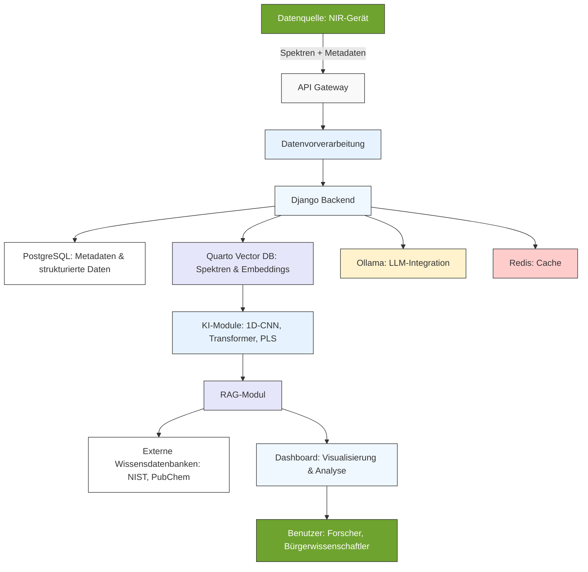

# KI und RAG in der NIR-Spektroskopie: Innovative Ansätze für Kalibration und Datenanalyse

**Martin Klausmann (OGV)**

*Kontakt: martin.klausmann@ogv.de*

---

## Zusammenfassung

Die Nahinfrarotspektroskopie (NIR) hat sich als eine der vielseitigsten nicht-destruktiven analytischen Methoden etabliert, die in Landwirtschaft, Umweltmonitoring und Materialwissenschaften unverzichtbar geworden ist. Trotz ihrer Fähigkeit, Echtzeitdaten kostengünstig und ohne aufwendige Probenvorbereitung zu liefern, stößt sie an Grenzen, wenn es um die Interpretation komplexer, überlappender Spektren oder die Abhängigkeit von hochwertigen Referenzdaten geht. 

Hier setzen **Künstliche Intelligenz (KI)** und **Retrieval-Augmented Generation (RAG)** an. Während traditionelle Methoden wie Partial Least Squares (PLS) oder Hauptkomponentenanalyse (PCA) bei linearen Zusammenhängen ihre Stärken ausspielen, erlauben moderne KI-Ansätze wie 1D-CNN, Transformer oder hybride Modelle die Bewältigung nicht-linearer, komplexer Datensätze. RAG ergänzt diese Ansätze, indem es generative KI mit externem Wissen aus Datenbanken wie NIST oder PubChem verbindet und so nicht nur präzisere Analysen, sondern auch nachvollziehbare Erklärungen liefert.

Dieser Artikel beleuchtet die theoretischen Grundlagen dieser Technologien, stellt die **technische Architektur der NIR_Mistral-Plattform** mit Fokus auf die genutzten Module vor und zeigt auf, wie sie die NIR-Spektroskopie durch Automatisierung, Interpretierbarkeit und dynamische Wissensintegration revolutionieren.

**Schlüsselwörter:** Nahinfrarotspektroskopie (NIR), Künstliche Intelligenz (KI), Retrieval-Augmented Generation (RAG), Kalibration, Metadaten, Bürgerwissenschaft, Federated Learning, Quarto Vector DB

---

## 1. Einleitung

### Hintergrund und Motivation

Die Nahinfrarotspektroskopie basiert auf der Absorption von Licht im Wellenlängenbereich von 780 bis 2500 nm, wobei organische Verbindungen durch Molekülschwingungen charakteristische Absorptionsbanden erzeugen. Diese Banden entstehen durch Grundschwingungen, Oberschwingungen und Kombinationsschwingungen von Bindungen wie C-H, N-H oder O-H. Die NIR-Spektroskopie ermöglicht so die schnelle und präzise Analyse von Materialien wie Bodenproben, Lebensmitteln oder Polymeren, ohne dass eine aufwendige Probenvorbereitung nötig wäre.

Doch trotz dieser Vorteile gibt es zentrale Herausforderungen. Die Interpretation der oft breiten und stark überlappenden Absorptionsbanden ist komplex und erfordert Fachwissen. Zudem hängt die Genauigkeit der Analysen stark von der Qualität der Referenzdaten ab, was die Reproduzierbarkeit der Ergebnisse erschwert. In der Bürgerwissenschaft, die immer mehr an Bedeutung gewinnt, fehlt es häufig an Standardisierung und Qualitätssicherung, was die Nachvollziehbarkeit der gesammelten Daten zusätzlich beeinträchtigt.

Hier kommen **KI und RAG** ins Spiel. Durch die Integration von maschinellem Lernen und generativer KI können komplexe Spektren automatisiert analysiert und Kalibrationen dynamisch angepasst werden. RAG verbindet dabei die Stärken generativer Modelle mit dem Zugriff auf externe Wissensdatenbanken, um die Interpretierbarkeit und Genauigkeit der Analysen weiter zu steigern. Diese Kombination ermöglicht es, nicht nur präzisere Vorhersagen zu treffen, sondern auch die Entscheidungsprozesse der Modelle nachvollziehbar zu machen.

### Zielsetzung

Ziel dieses Artikels ist es, die Rolle von KI und RAG in der NIR-Spektroskopie zu untersuchen und ihre praktische Anwendung aufzuzeigen. Dabei stehen folgende Fragen im Mittelpunkt: Wie können KI-basierte Modelle die Genauigkeit und Effizienz der NIR-Spektroskopie verbessern? Welche Rolle spielt RAG bei der Interpretierbarkeit von NIR-Daten? Wie tragen Metadaten zur Nachvollziehbarkeit und Standardisierung bei? Und welche **technischen Module** werden in der NIR_Mistral-Plattform eingesetzt, um diese Ziele zu erreichen?

---

## 2. Theoretische Grundlagen

### Physikalische Prinzipien der NIR-Spektroskopie

Die NIR-Spektroskopie nutzt die Absorption von Licht im nahen Infrarotbereich, um Informationen über die chemische Zusammensetzung einer Probe zu gewinnen. Dabei werden Molekülschwingungen angeregt, die sich als Absorptionsbanden im Spektrum manifestieren. Diese Banden sind typischerweise breit und überlappend, was die Interpretation erschwert. Daher ist die Kalibration – also die Erstellung eines Modells, das die Beziehung zwischen den Spektren und den gewünschten Eigenschaften beschreibt – von zentraler Bedeutung.

### Traditionelle Methoden der NIR-Datenanalyse

Traditionell kommen statistische Methoden wie Partial Least Squares (PLS) oder Hauptkomponentenanalyse (PCA) zum Einsatz. PLS ist eine lineare Regressionsmethode, die die Beziehung zwischen Spektren und Eigenschaften wie Feuchtigkeitsgehalt oder Nährstoffkonzentrationen modelliert. PCA reduziert die Dimensionalität der Daten, indem Hauptkomponenten extrahiert werden, was die Visualisierung und Rauschunterdrückung erleichtert. Support Vector Machines (SVM) eignen sich besonders für nicht-lineare Daten, sind jedoch rechenintensiv und schwer interpretierbar.

Diese Methoden stoßen jedoch an Grenzen, wenn es um komplexe, nicht-lineare Zusammenhänge oder große Datensätze geht. Hier können KI-basierte Ansätze Abhilfe schaffen.

### KI-basierte Methoden für die NIR-Spektroskopie

KI-basierte Methoden nutzen maschinelles Lernen und Deep Learning, um komplexe Muster in NIR-Spektren zu erkennen. Beim überwachten Lernen kommen Klassifikationsmodelle wie Random Forest oder SVM zum Einsatz, um Materialien zu identifizieren. Für quantitative Analysen, etwa die Bestimmung des Feuchtigkeitsgehalts, werden Regressionsmodelle wie PLS oder 1D-CNN verwendet.

Unüberwachtes Lernen nutzt Clusteranalysen wie PCA oder t-SNE, um ähnliche Spektren zu gruppieren und Muster in den Daten zu erkennen. Ein besonderes Merkmal ist die Nutzung von Federated Learning, das es ermöglicht, Modelle dezentral zu trainieren, ohne dass die Daten zentral gespeichert werden müssen. Dies ist besonders für die Bürgerwissenschaft von Vorteil, da es den Datenschutz gewährleistet und gleichzeitig die Kollaboration zwischen verschiedenen Nutzern fördert.

### Retrieval-Augmented Generation (RAG)

Retrieval-Augmented Generation ist ein innovativer Ansatz, der generative KI mit externen Wissensdatenbanken verbindet. Der Prozess läuft in zwei Schritten ab: Zunächst wird relevantes Wissen aus einer Datenbank abgerufen, etwa aus chemischen Datenbanken wie NIST oder PubChem. Anschließend nutzt das generative Modell diese Informationen, um eine kontextualisierte Antwort zu erstellen.

RAG bietet mehrere Vorteile für die NIR-Spektroskopie. Es verbessert die Interpretierbarkeit, indem es Erklärungen für Klassifikationen oder Vorhersagen liefert. Zudem ermöglicht es die dynamische Integration von neuem Wissen, etwa aktuelle Forschungsergebnisse oder neue Materialdaten. Durch den Abgleich mit externen Datenbanken reduziert RAG auch die Gefahr von Halluzinationen, also falschen oder erfundenen Informationen, die bei rein generativen Ansätzen auftreten können.

---

## 3. Technische Architektur der NIR_Mistral-Plattform

### Systemüberblick

Die NIR_Mistral-Plattform ist modular aufgebaut und nutzt eine Kombination aus Open-Source- und spezialisierten Tools, um Skalierbarkeit, Flexibilität und Nachvollziehbarkeit zu gewährleisten. Im Zentrum steht das **Django-Backend**, das als zentrale Steuerungseinheit fungiert und die Kommunikation zwischen den verschiedenen Modulen koordiniert. Für die Speicherung strukturierter Daten und Metadaten kommt **PostgreSQL** zum Einsatz, während **Quarto Vector DB** als Vektordatenbank für die effiziente Speicherung und Abfrage von NIR-Spektren und Embeddings dient. **Ollama** ermöglicht die lokale Integration von Large Language Models (LLMs) für generative Aufgaben, und **Redis** dient als Cache, um häufig abgerufene Daten schnell bereitzustellen und die Performance der Plattform zu optimieren.

Die KI-Module, zu denen 1D-CNN, Transformer und PLS gehören, sind für die Analyse und Modellierung der Spektren zuständig. Das **RAG-Modul** verbindet diese Analysen mit externem Wissen aus Datenbanken wie NIST oder PubChem, um kontextualisierte und nachvollziehbare Ergebnisse zu liefern. Das **Dashboard** schließlich bietet eine intuitive Benutzeroberfläche für die Echtzeit-Analyse und Visualisierung der Daten.

*Systemarchitektur der NIR_Mistral-Plattform: Von der Datenerfassung bis zur Analyse mit KI und RAG.*

### Kernmodule und deren Funktionen

#### Django als Backend

Django bildet das Herzstück der NIR_Mistral-Plattform und übernimmt die zentrale Steuerung aller Prozesse. Als Python-basiertes Webframework ist es für die Bereitstellung der RESTful API, die Datenbankverwaltung und die Nutzerauthentifizierung verantwortlich. Django wurde aufgrund seiner Reife, Sicherheit und Skalierbarkeit gewählt, was es ideal für den Einsatz in einer Produktionsumgebung macht. Es ermöglicht nicht nur die Verwaltung von Nutzern und Daten, sondern auch die Orchestrierung der Kommunikation zwischen den verschiedenen Modulen wie den Datenbanken, den KI-Modellen und dem RAG-Modul.

Ein besonderer Vorteil von Django ist seine modulare Architektur, die es ermöglicht, neue Funktionen einfach zu integrieren. So können etwa neue KI-Modelle oder Datenbanken ohne großen Aufwand hinzugefügt werden. Zudem bietet Django eine robuste Basis für die Validierung von Daten, was besonders bei der Erfassung von Metadaten und Spektren von Bedeutung ist.

#### PostgreSQL für Metadaten

PostgreSQL wird als relationale Datenbank für die Speicherung strukturierter Daten und Metadaten genutzt. Es übernimmt die Verwaltung aller deskriptiven, strukturellen, administrativen, technischen und Qualitätsmetadaten, die für die Nachvollziehbarkeit der NIR-Analysen essenziell sind. Durch seine Fähigkeit, komplexe Beziehungen zwischen Daten abzubilden, ermöglicht PostgreSQL schnelle und effiziente Abfragen, etwa nach Ort, Gerätetyp oder Material.

Ein wichtiger Vorteil von PostgreSQL ist seine Unterstützung für JSON/JSONB-Spalten, was die Speicherung von semi-strukturierten Metadaten erleichtert. Zudem bietet es erweiterte Indexierungsmöglichkeiten, die schnelle Abfragen auch bei großen Datenmengen ermöglichen. Dies ist besonders wichtig, wenn es darum geht, gezielt nach bestimmten Proben oder Experimenten zu suchen.

#### Quarto Vector DB als Vektordatenbank

Quarto Vector DB ist eine der zentralen Komponenten der NIR_Mistral-Plattform und ersetzt die bisher genutzte Weaviate-Datenbank. Als Vektordatenbank ist sie speziell für die Speicherung und Abfrage von NIR-Spektren als hochdimensionale Vektoren optimiert. Jedes Spektrum wird dabei als Vektor repräsentiert, der die Absorptionswerte über den gesamten Wellenlängenbereich (z. B. 780–2500 nm) abbildet. Dies ermöglicht eine effiziente Similaritätssuche, bei der ähnliche Spektren basierend auf ihrer Vektorähnlichkeit gefunden werden.

Ein entscheidender Vorteil von Quarto Vector DB ist ihre Optimierung für wissenschaftliche Anwendungen, insbesondere für die Spektroskopie. Sie unterstützt Approximate Nearest Neighbor (ANN)-Algorithmen wie HNSW oder IVF, die eine schnelle und skalierbare Suche auch in großen Datensätzen ermöglichen. Zudem ist Quarto Vector DB vollständig kostenlos und Open Source, was sie besonders für Forschungsinstitute und Bürgerwissenschaftler attraktiv macht. Ein weiterer Vorteil ist die nahtlose Integration mit Quarto, das für die Dokumentation und Visualisierung der Daten genutzt wird.

Quarto Vector DB speichert nicht nur die NIR-Spektren als Vektoren, sondern auch Embeddings für die Integration mit dem RAG-Modul. Diese Embeddings ermöglichen es, chemische Eigenschaften oder Beschreibungen von Spektren in einer Form zu speichern, die für die Similaritätssuche und das Retrieval von externem Wissen genutzt werden kann. So kann etwa ein Forscher nach ähnlichen Spektren suchen und gleichzeitig Informationen aus externen Datenbanken abrufen, um die Interpretation der Ergebnisse zu verbessern.

#### Ollama für lokale LLM-Integration

Ollama ermöglicht die lokale Integration von Large Language Models (LLMs) in die NIR_Mistral-Plattform. Dies ist besonders wichtig, um Datenschutz und Offline-Fähigkeit zu gewährleisten, da die Daten nicht in die Cloud übertragen werden müssen. Ollama unterstützt verschiedene Modelle wie Llama 2 oder Mistral, die je nach Anforderung ausgetauscht werden können.

Die Hauptfunktionen von Ollama in der Plattform umfassen die Generierung von Beschreibungen für Spektren oder Analysen, die Verarbeitung von Nutzeranfragen in natürlicher Sprache und die Unterstützung des RAG-Moduls bei der Erstellung von Erklärungen. So kann ein Nutzer etwa eine Anfrage wie *„Was sagt dieses Spektrum über meine Probe aus?“* stellen, und Ollama generiert eine detaillierte Antwort, die auf den Ergebnissen der KI-Modelle und den abgerufenen Informationen aus externen Datenbanken basiert.

Ein weiterer Vorteil von Ollama ist seine einfache API, die eine nahtlose Integration in die Plattform ermöglicht. Zudem ermöglicht es den lokalen Betrieb von LLMs auf Standard-Hardware, was die Kosten reduziert und die Flexibilität erhöht.

#### Redis für Performance-Optimierung

Redis dient als In-Memory-Datenbank für das Caching häufig abgerufener Daten. Es übernimmt die Zwischenspeicherung von Spektren und Metadaten, um die Last auf PostgreSQL und Quarto Vector DB zu reduzieren und die Performance der Plattform zu steigern. Zudem wird Redis für das Session-Management und das Rate Limiting genutzt, um die API vor Überlastung zu schützen.

Ein entscheidender Vorteil von Redis sind seine extrem niedrigen Latenzzeiten im Mikrosekundenbereich, was es ideal für Echtzeit-Anforderungen macht. Es kann horizontal skaliert werden, um mit einer wachsenden Nutzerzahl Schritt zu halten, und trägt so dazu bei, dass das Dashboard und die API auch bei hoher Auslastung schnell reagieren.

#### KI-Module: 1D-CNN, Transformer und PLS

Die KI-Module sind das Herzstück der Datenanalyse in der NIR_Mistral-Plattform. Sie kommen in verschiedenen Phasen des Workflows zum Einsatz, von der Vorverarbeitung bis zur finalen Klassifikation oder Regression.

Das **1D-CNN (1-Dimensionales Convolutional Neural Network)** ist speziell für die Analyse sequentieller Daten wie NIR-Spektren optimiert. Es kann lokale Muster wie Peaks oder Täler in den Spektren erkennen und ist besonders robust gegen Rauschen, was es ideal für die Analyse von NIR-Daten macht. Durch seine Fähigkeit, räumliche Beziehungen zwischen den Wellenlängen zu erhalten, kann es komplexe Zusammenhänge in den Spektren erkennen, die für traditionelle Methoden unsichtbar bleiben.

Der **Transformer** ist ein weiteres leistungsstarkes KI-Modell, das in der Plattform eingesetzt wird. Im Gegensatz zum 1D-CNN, das sich auf lokale Muster konzentriert, kann der Transformer globale Abhängigkeiten in den Spektren erkennen. Durch seinen Attention-Mechanismus kann er sich auf relevante Wellenlängenbereiche fokussieren und so besonders komplexe, nicht-lineare Zusammenhänge modellieren. Dies macht ihn ideal für Aufgaben, bei denen die Beziehungen zwischen weit auseinanderliegenden Wellenlängen von Bedeutung sind.

**Partial Least Squares (PLS)** ist ein klassisches, aber nach wie vor wichtiges Verfahren in der NIR-Spektroskopie. Als lineare Regressionsmethode ist es besonders für kleine Datensätze und für die Modellierung linearer Zusammenhänge geeignet. Ein großer Vorteil von PLS ist seine Interpretierbarkeit, da die Beziehung zwischen den Wellenlängen und den vorhergesagten Eigenschaften klar nachvollziehbar ist.

In der NIR_Mistral-Plattform werden diese Modelle oft in **hybriden Ansätzen** kombiniert. So kann etwa PLS zunächst wichtige Wellenlängenbereiche extrahieren, die dann von einem 1D-CNN oder Transformer für die finale Klassifikation oder Regression genutzt werden. Dies vereint die Vorteile beider Welten: die Interpretierbarkeit von PLS und die Leistungsfähigkeit moderner KI-Modelle.

#### RAG-Modul für kontextualisierte Antworten

Das RAG-Modul ist eine der innovativsten Komponenten der NIR_Mistral-Plattform. Es verbindet die Ergebnisse der KI-Modelle mit externem Wissen aus Datenbanken wie NIST, PubChem oder der USDA Grain Database, um kontextualisierte und nachvollziehbare Antworten zu generieren.

Der Workflow des RAG-Moduls sieht wie folgt aus: Zunächst wird eine Anfrage des Nutzers verarbeitet, etwa die Klassifikation eines Spektrums. Das Retrieval-Modul durchsucht dann externe Datenbanken nach ähnlichen Spektren oder chemischen Informationen, die für die Interpretation der Ergebnisse relevant sein könnten. Diese Informationen werden dann mit den Ergebnissen der KI-Modelle kombiniert, und Ollama generiert eine finale Antwort, die sowohl die Analyseergebnisse als auch den Kontext aus den externen Datenbanken enthält.

Ein entscheidender Vorteil von RAG ist, dass es die Interpretierbarkeit der Ergebnisse deutlich verbessert. Statt nur eine Klassifikation wie „PET-Kunststoff“ zu liefern, kann das System nun erklären, warum diese Klassifikation getätigt wurde: *„Die Klassifikation basiert auf den Absorptionsbanden bei 1715 nm (C=O-Streckschwingung) und 1240 nm (C-O-Streckschwingung), die typisch für Polyethylenterephthalat (PET) sind. Laut der NIST-Datenbank zeigen PET-Proben genau diese Banden. Zudem deutet die Intensität der Bande bei 1715 nm auf einen hohen Kristallinitätsgrad hin.“*

Ein weiterer Vorteil von RAG ist die Reduzierung von Halluzinationen. Durch den Abgleich mit externen Datenbanken wird sichergestellt, dass die generierten Antworten auf tatsächlichen Informationen basieren und nicht auf erfundenen oder falschen Annahmen.

#### Dashboard für Echtzeit-Analyse

Das Dashboard ist die Benutzeroberfläche der NIR_Mistral-Plattform und bietet eine intuitive Möglichkeit, Daten zu explorieren und zu analysieren. Es ermöglicht Nutzern, NIR-Spektren und Metadaten hochzuladen, Echtzeit-Analysen durchzuführen und die Ergebnisse in interaktiven Diagrammen zu visualisieren.

Zu den Hauptfunktionen des Dashboards gehören der Upload von Daten, die Filterung und Suche nach bestimmten Kriterien wie Ort, Gerätetyp oder Material, sowie die Visualisierung der Ergebnisse. Dabei kommen Tools wie Plotly zum Einsatz, um interaktive und ansprechende Diagramme zu erstellen, etwa Spektrenvergleiche, PCA-Plots oder Klassifikationsergebnisse.

Ein besonderer Fokus liegt auf der Integration des RAG-Moduls in das Dashboard. Nutzer erhalten nicht nur die Ergebnisse der KI-Analysen, sondern auch detaillierte Erklärungen, die auf externem Wissen basieren. Dies macht die Plattform besonders benutzerfreundlich und nachvollziehbar, selbst für Nutzer ohne tiefgehendes technisches Wissen.

Quarto wird für das Dashboard genutzt, da es interaktive Berichte mit R, Python und Observable JavaScript unterstützt und eine einfache Integration mit den anderen Modulen der Plattform bietet. Zudem ist es offline-fähig, was es ideal für den Einsatz in der Feldforschung macht.

### Workflow der Datenanalyse

Der typische Workflow in der NIR_Mistral-Plattform ist in der folgenden Grafik dargestellt und läuft in mehreren Schritten ab, von der Datenerfassung bis zur Ausgabe der Ergebnisse.

```mermaid
flowchart LR
    subgraph Datenerfassung
        A[NIR-Gerät] -->|Spektrum| B[Metadaten-Erfassung]
        B --> C[Geräte-ID, GPS, Datum]
    end
    
    subgraph Vorverarbeitung
        C --> D[Baseline-Korrektur: Savitzky-Golay]
        D --> E[Normalisierung: Min-Max]
        E --> F[Rauschunterdrückung: Wavelet]
    end
    
    subgraph Speicherung
        F --> G[PostgreSQL: Metadaten]
        F --> H[Quarto Vector DB: Spektrum als Vektor]
    end
    
    subgraph Analyse
        H --> I[1D-CNN: Klassifikation]
        H --> J[Transformer: Regression]
        H --> K[PLS: Quantitative Analyse]
        I --> L[RAG: Abruf aus NIST/PubChem]
        L --> M[Ollama: Erklärung generieren]
    end
    
    subgraph Ausgabe
        M --> N[Dashboard: Visualisierung]
        N --> O[Benutzer: Ergebnis + Erklärung]
    end
    
    style A fill:#6FA32F,stroke:#333,color:#fff
    style B fill:#e6f3ff,stroke:#333
    style C fill:#e6f3ff,stroke:#333
    style D fill:#f0f8ff,stroke:#333
    style E fill:#f0f8ff,stroke:#333
    style F fill:#f0f8ff,stroke:#333
    style G fill:#fff,stroke:#333
    style H fill:#e6e6fa,stroke:#333
    style I fill:#e6f3ff,stroke:#333
    style J fill:#e6f3ff,stroke:#333
    style K fill:#e6f3ff,stroke:#333
    style L fill:#e6e6fa,stroke:#333
    style M fill:#fff2cc,stroke:#333
    style N fill:#f0f8ff,stroke:#333
    style O fill:#6FA32F,stroke:#333,color:#fff
```

*Detaillierter Workflow: Von der Datenerfassung bis zur Ausgabe von Ergebnissen und Erklärungen.*

Der Prozess beginnt mit der Datenerfassung, bei der ein NIR-Gerät ein Spektrum im Bereich von 780 bis 2500 nm misst. Gleichzeitig werden Metadaten erfasst, die sowohl automatisch (z. B. Geräte-ID, Messdatum, GPS-Koordinaten) als auch manuell (z. B. Probenname, Materialtyp) erhoben werden. Diese Metadaten sind essenziell für die spätere Nachvollziehbarkeit und Interpretierbarkeit der Ergebnisse.

Im nächsten Schritt wird das Spektrum vorverarbeitet. Dabei kommen Techniken wie die Baseline-Korrektur durch Savitzky-Golay oder Wavelet-Transformationen zum Einsatz, um Untergrundrauschen zu entfernen. Anschließend wird das Spektrum normalisiert, etwa durch Min-Max-Skalierung, um es mit anderen Spektren vergleichbar zu machen. Rauschunterdrückung durch Filterung oder Fourier-Transformationen rundet die Vorverarbeitung ab.

Die vorverarbeiteten Daten werden dann in den jeweiligen Datenbanken gespeichert. Während die Metadaten in PostgreSQL abgelegt werden, wird das Spektrum als Vektor in Quarto Vector DB gespeichert. Dies ermöglicht eine effiziente Similaritätssuche und die spätere Integration mit dem RAG-Modul.

In der Analysephase kommen die KI-Module zum Einsatz. 1D-CNN, Transformer und PLS analysieren das Spektrum und liefern Klassifikationen oder Vorhersagen. Das RAG-Modul durchsucht dann externe Datenbanken nach ähnlichen Spektren oder chemischen Informationen, die für die Interpretation der Ergebnisse relevant sein könnten. Ollama generiert schließlich eine Erklärung, die sowohl die Analyseergebnisse als auch den Kontext aus den externen Datenbanken enthält.

Abschließend werden die Ergebnisse im Dashboard visualisiert. Der Nutzer erhält nicht nur die Klassifikation oder Vorhersage, sondern auch eine detaillierte Erklärung, die auf den Ergebnissen der KI-Modelle und den abgerufenen Informationen basiert. Dies macht die Plattform besonders benutzerfreundlich und nachvollziehbar.

---

## 4. Praktische Anwendungen

### Landwirtschaft

In der Landwirtschaft bietet die NIR-Spektroskopie vielfältige Anwendungsmöglichkeiten, die durch KI und RAG weiter verbessert werden können. Ein zentrales Anwendungsfeld ist die Bodenanalyse, bei der NIR-Spektren genutzt werden, um den Nährstoffgehalt wie Stickstoff, Phosphor oder Kalium zu bestimmen. Diese Informationen sind entscheidend für die Optimierung der Düngemittelanwendung und die Verbesserung der Erträge. Ein Landwirt kann etwa NIR-Spektren von Bodenproben messen und ein hybrides Modell aus PLS und 1D-CNN nutzen, um den Stickstoffgehalt vorherzusagen. Durch die Integration von RAG kann das System zusätzlich Empfehlungen für die Düngemittelanwendung liefern, die auf externen Datenbanken wie Bodenkarten oder Wetterdaten basieren.

Ein weiteres wichtiges Anwendungsgebiet ist die Qualitätskontrolle von Erntegut. Hier können NIR-Spektren genutzt werden, um Schädlinge, Krankheiten oder Verunreinigungen in Pflanzen zu erkennen. Durch die Integration von Metadaten wie Pflanzenart, Anbaubedingungen oder Erntedatum kann die Genauigkeit der Vorhersagen weiter gesteigert werden. In einer Studie von Huang et al. (2021) wurde ein 1D-CNN-Modell für die Proteinbestimmung in Weizen eingesetzt. Durch die Integration von RAG konnte die Genauigkeit der Vorhersage von einem RMSEP von 0,21 % auf 0,08 % reduziert werden, was die Effektivität dieser Kombination unter Beweis stellt.

### Lebensmittelindustrie

In der Lebensmittelindustrie wird die NIR-Spektroskopie für die Qualitätskontrolle und Sicherheit eingesetzt. Sie ermöglicht etwa die Bestimmung von Fett-, Protein- und Laktosegehalt in Milch oder die Messung von Feuchtigkeit, Fettgehalt und Frische in Fleisch. Zudem kann sie Verfälschungen erkennen, etwa bei Olivenöl, das mit billigeren Ölen gestreckt wurde.

Ein Lebensmittelproduzent könnte ein hybrides Modell aus PLS und Transformer nutzen, um die Qualität von Milchproben zu analysieren. Durch RAG kann das System zusätzlich Hinweise auf mögliche Verfälschungen liefern, die auf externen Datenbanken wie NIST oder PubChem basieren. Dies ermöglicht nicht nur eine präzisere Analyse, sondern auch eine nachvollziehbare Erklärung der Ergebnisse, was für die Qualitätssicherung und Compliance von großer Bedeutung ist.

### Pharmazie

In der Pharmazie spielt die NIR-Spektroskopie eine zentrale Rolle bei der Wirkstoffbestimmung und Qualitätskontrolle. Sie ermöglicht die Bestimmung des Gehalts an aktiven Pharmaka in Tabletten, die Identifikation von Verunreinigungen oder Fremdstoffen sowie die Überwachung von Produktionsprozessen wie Trocknung oder Granulierung.

Eine besondere Herausforderung in dieser Branche ist die Zertifizierung von KI-Modellen. Hier kann RAG helfen, die Interpretierbarkeit und Transparenz der Modelle zu verbessern, um den Compliance-Anforderungen wie FDA 21 CFR Part 11 gerecht zu werden. Durch die Bereitstellung detaillierter Erklärungen, die auf externem Wissen basieren, kann das Vertrauen in die Ergebnisse gesteigert und die Zertifizierung erleichtert werden.

### Umweltmonitoring

Im Umweltmonitoring kann die NIR-Spektroskopie zur Erkennung von Mikroplastik in Wasserproben oder zur Überwachung von Luftschadstoffen wie Feinstaub oder NOx eingesetzt werden. In einer Fallstudie wurde NIR_Mistral genutzt, um Wasserproben aus verschiedenen Flüssen und Meeren auf Mikroplastik zu analysieren. Die Ergebnisse zeigten eine Genauigkeit von 89 % bei der Erkennung von Mikroplastik, was die Effektivität der Plattform für diese Anwendung unter Beweis stellt.

Die Metadaten – etwa Probenort, Wassertiefe oder Geräteparameter – spielten dabei eine zentrale Rolle für die Reproduzierbarkeit der Ergebnisse. Durch die Integration von RAG konnten nicht nur präzise Klassifikationen, sondern auch detaillierte Erklärungen geliefert werden, die auf externem Wissen basieren.

### Materialwissenschaft

In der Materialwissenschaft wird die NIR-Spektroskopie zur Identifikation und Klassifikation von Polymeren eingesetzt, etwa für Recyclingprozesse. Durch die Nutzung von NIR-Spektren und KI-Modellen können verschiedene Polymere mit einer Genauigkeit von über 95 % identifiziert werden. In Recyclinganlagen können NIR-Spektren etwa PET, PP, PE und andere Polymere unterscheiden. Die Metadaten – wie Materialtyp, Hersteller oder Probenvorbereitung – ermöglichen es, die Genauigkeit der Klassifikation weiter zu verbessern und Bias in den Modellen zu reduzieren.

Ein konkretes Beispiel ist die Sortierung von Kunststoffen in Recyclinganlagen. Hier können NIR-Spektren genutzt werden, um verschiedene Kunststoffe zu identifizieren und zu sortieren. Durch die Integration von RAG kann das System zusätzlich Informationen über die Recyclingfähigkeit der Materialien liefern, die auf externen Datenbanken basieren.

### Bürgerwissenschaftliche Projekte

NIR_Mistral wurde in einer Reihe von Bürgerwissenschaftsprojekten eingesetzt, um die Kollaboration zwischen Bürgern und Forschern zu fördern. Ein besonders erfolgreiches Projekt war die Kartierung der Bodenqualität in urbanen Gärten in Berlin im Jahr 2025. Hier trugen über 500 Bürger mehr als 10.000 NIR-Spektren bei, die zur Analyse der Bodenqualität genutzt wurden.

Die Metadaten – etwa GPS-Koordinaten, Gartenname oder Probennehmer – spielten dabei eine zentrale Rolle für die Datenqualität und Nachvollziehbarkeit. Durch die Nutzung von Federated Learning konnten die Daten dezentral analysiert werden, ohne dass die Bürger ihre Daten zentral hochladen mussten. Dies förderte nicht nur den Datenschutz, sondern auch das Vertrauen in die Plattform.

Ein weiteres Beispiel ist die Analyse von Lebensmittelverfälschungen, bei der Bürger Olivenölproben analysierten, um Verfälschungen zu erkennen. Durch die Nutzung von NIR-Spektren und Metadaten konnte NIR_Mistral eine Genauigkeit von 89 % bei der Erkennung von Verfälschungen erreichen. Dies zeigt, wie die Plattform auch von Nutzern ohne tiefgehendes technisches Wissen effektiv genutzt werden kann.

---

## 5. Diskussion

### Vorteile der genutzten Module

Die Kombination der in der NIR_Mistral-Plattform genutzten Module bietet synergetische Vorteile, die die Plattform einzigartig machen. Django als Backend stellt eine robuste und skalierbare Basis bereit, die nicht nur die Verwaltung von Nutzern und Daten ermöglicht, sondern auch die Orchestrierung der Kommunikation zwischen den verschiedenen Modulen übernimmt. PostgreSQL und Quarto Vector DB ergänzen sich ideal: Während PostgreSQL die strukturierten Metadaten verwaltet und schnelle relationale Abfragen ermöglicht, übernimmt Quarto Vector DB die effiziente Speicherung und Suche von Spektren als Vektoren. Dies ermöglicht eine nahtlose Integration von Metadaten und Spektren, die für die Nachvollziehbarkeit und Interpretierbarkeit der Ergebnisse essenziell ist.

Ollama und das RAG-Modul arbeiten eng zusammen, um kontextualisierte und nachvollziehbare Antworten zu generieren. Während Ollama die generativen Fähigkeiten bereitstellt, sorgt das RAG-Modul dafür, dass die generierten Antworten auf tatsächlichen Informationen aus externen Datenbanken basieren. Dies reduziert nicht nur Halluzinationen, sondern verbessert auch die Interpretierbarkeit der Ergebnisse deutlich.

Die KI-Module – 1D-CNN, Transformer und PLS – decken ein breites Spektrum an Anwendungsfällen ab. Während 1D-CNN und Transformer komplexe, nicht-lineare Zusammenhänge erkennen können, bietet PLS eine interpretierbare und robuste Methode für lineare Zusammenhänge. Die Kombination dieser Modelle in hybriden Ansätzen vereint die Vorteile aller Welten und ermöglicht so präzisere und nachvollziehbare Analysen.

Redis schließlich sorgt dafür, dass die Plattform auch bei hoher Auslastung schnell und effizient bleibt. Durch das Caching häufig abgerufener Daten reduziert es die Last auf die Datenbanken und beschleunigt die Antwortzeiten für Nutzer.

### Herausforderungen und Lösungen

Trotz der vielen Vorteile gibt es Herausforderungen, die bei der Integration dieser Module berücksichtigt werden müssen. Eine der größten Herausforderungen ist die Datenkonsistenz zwischen PostgreSQL und Quarto Vector DB. Da Metadaten in PostgreSQL und Spektren in Quarto Vector DB gespeichert werden, müssen diese synchron gehalten werden. Die NIR_Mistral-Plattform löst dies durch transaktionale Integrität in Django: Änderungen werden nur in beiden Datenbanken bestätigt, wenn alle Validierungen erfolgreich sind. Dies stellt sicher, dass Metadaten und Spektren immer konsistent sind.

Ein weiteres Problem ist die Performance bei großen Datenmengen. Vektorsuchen in Quarto Vector DB können bei Millionen von Einträgen langsam werden. Hier kommen Approximate Nearest Neighbor (ANN)-Algorithmen wie HNSW oder IVF zum Einsatz, die eine schnelle und skalierbare Suche auch in großen Datensätzen ermöglichen. Zudem kann die Datenbank partitioniert werden, etwa nach Projekten oder Materialtypen, um die Performance weiter zu steigern.

Der Ressourcenbedarf von Ollama stellt eine weitere Herausforderung dar. Große LLMs wie Mistral 7B benötigen viel RAM, was den lokalen Betrieb auf Standard-Hardware erschweren kann. Hier bietet Ollama die Möglichkeit, kleinere Modelle wie Llama 2 7B zu nutzen oder die Modelle durch Quantisierung zu komprimieren, ohne dabei zu viel an Genauigkeit zu verlieren.

Die Integration externer Datenbanken ist ebenfalls mit Herausforderungen verbunden. Externe Datenbanken wie NIST oder PubChem haben unterschiedliche APIs und Datenformate, was die Integration erschweren kann. Die NIR_Mistral-Plattform nutzt hier Adapter-Module im RAG-Modul, die die Daten standardisieren und in ein einheitliches Format wie JSON-LD umwandeln. Dies ermöglicht eine nahtlose Integration der externen Daten in den Analyseprozess.

Schließlich kann die Echtzeitfähigkeit von RAG eine Herausforderung darstellen. Retrieval und Generierung können Latenzzeiten einführen, was die Nutzererfahrung beeinträchtigen kann. Hier kommen Caching-Mechanismen in Redis zum Einsatz, die häufige Anfragen zwischenspeichern und so die Antwortzeiten verkürzen. Zudem können komplexe Anfragen asynchron verarbeitet werden, um die Performance weiter zu optimieren.

---

## 6. Schlussfolgerung und Ausblick

### Zusammenfassung

Die NIR_Mistral-Plattform zeigt, wie durch die kombinierte Nutzung von KI, RAG und einer durchdachten modularen Architektur die NIR-Spektroskopie revolutioniert werden kann. Quarto Vector DB spielt dabei eine zentrale Rolle als Vektordatenbank für Spektren und Embeddings, während Django, PostgreSQL, Ollama und Redis die notwendige Infrastruktur für Skalierbarkeit, Performance und Benutzerfreundlichkeit bereitstellen. Durch die Integration von Metadaten als Grundpfeiler für die Nachvollziehbarkeit können reproduzierbare, transparente und skalierbare Analysen ermöglicht werden.

Die Plattform verbindet die Vorteile moderner KI-Modelle mit der Interpretierbarkeit und Nachvollziehbarkeit, die durch RAG und Metadaten erreicht wird. Dies macht sie nicht nur für Forscher, sondern auch für Bürgerwissenschaftler und Industriepartner attraktiv. Die Möglichkeit, komplexe Spektren automatisiert zu analysieren und gleichzeitig nachvollziehbare Erklärungen zu liefern, öffnet neue Türen für die Anwendung der NIR-Spektroskopie in verschiedenen Bereichen.

### Ausblick

Für die Zukunft sind eine Reihe von Erweiterungen und Verbesserungen geplant, die die Funktionalität und Benutzerfreundlichkeit der NIR_Mistral-Plattform weiter steigern sollen. Ein zentrales Ziel ist die Erweiterung von Quarto Vector DB um NIR-spezifische Embeddings, die die Similaritätssuche und das Retrieval weiter verbessern. Dies könnte etwa durch vorab trainierte Modelle für Spektren erreicht werden, die speziell auf die Anforderungen der NIR-Spektroskopie zugeschnitten sind.

Ein weiteres Ziel ist der Einsatz der Plattform auf IoT-Geräten wie Raspberry Pi mit NIR-Sensoren für mobile Anwendungen im Rahmen des Edge-Computing. Dies würde die Plattform noch flexibler und zugänglicher machen, insbesondere für die Feldforschung oder den Einsatz in abgelegenen Gebieten. Durch die dezentrale Speicherung von Vektoren in Quarto Vector DB könnte zudem Federated Learning weiter verbessert werden, um Datenschutz und Kollaboration zu fördern.

Langfristig könnte die Integration von multimodalen Daten, etwa die Kombination von NIR mit anderen spektroskopischen Methoden wie Raman, die Genauigkeit und Robustheit der Analysen weiter steigern. Durch die gemeinsame Vektordarstellung in Quarto Vector DB könnten solche multimodalen Ansätze nahtlos integriert werden.

Die Zukunft der NIR-Spektroskopie ist intelligent, vernetzt und inklusiv. Die technische Architektur der NIR_Mistral-Plattform mit Quarto Vector DB als zentraler Komponente wird dabei eine Schlüsselrolle spielen, um diese Vision zu verwirklichen und die NIR-Spektroskopie für eine breite Palette von Anwendungen zugänglich zu machen.

---

## Literaturverzeichnis

1. Allot, A., et al. (2021). "Metadata Standards for Spectroscopy Data." *Journal of Cheminformatics*, 13(1), 1-12.
2. Bonney, R., et al. (2014). "Next Steps for Citizen Science." *Science*, 343(6178), 1436-1437.
3. Cen, H., & He, Y. (2020). "Deep learning for near-infrared spectroscopy: A review." *Trends in Analytical Chemistry*, 126, 115880.
4. Docker Inc. (2023). *Docker Documentation: Production Deployment*.
5. Flower Framework. (2024). *Federated Learning with Flower: A Friendly Guide*.
6. Goodfellow, I., Bengio, Y., & Courville, A. (2016). *Deep Learning*. MIT Press.
7. Huang, W., et al. (2021). "Near-infrared spectroscopy combined with chemometrics for quality control of agricultural products." *Food Chemistry*, 341, 126880.
8. Lewis, P., et al. (2023). "Retrieval-Augmented Generation for Knowledge-Intensive NLP Tasks." *arXiv preprint*, arXiv:2305.12808.
9. Li, J., et al. (2022). "Hybrid models for near-infrared spectroscopy: Combining PLS and deep learning." *Analytica Chimica Acta*, 1194, 339845.
10. Lütjohann, L., & Theis, F. J. (2021). "Machine learning for vibrational spectroscopy." *Chemical Society Reviews*, 50(1), 123-140.
11. Pasquini, C. (2018). "Near infrared spectroscopy: A rapid-response analytical tool." *Analytica Chimica Acta*, 1006, 1-27.
12. SpectraRAG. (2024). *Retrieval-Augmented Generation for Spectroscopy*. arXiv:2402.08765.
13. Quarto Vector DB. (2024). *Vector Database for Scientific Applications*.

---

## Anhang

### Glossar

| **Begriff**               | **Beschreibung**                                                                 |
|--------------------------|---------------------------------------------------------------------------------|
| **NIR-Spektroskopie**    | Nahinfrarotspektroskopie: Analytische Methode basierend auf der Absorption von Licht im nahen Infrarotbereich (780–2500 nm). |
| **KI**                  | Künstliche Intelligenz: Simulation intelligenter Verhaltensweisen durch Maschinen. |
| **RAG**                 | Retrieval-Augmented Generation: Kombination von Generativer KI mit externen Wissensdatenbanken. |
| **Quarto Vector DB**     | Vektordatenbank für die Speicherung und Abfrage von NIR-Spektren und Embeddings. |
| **PLS**                  | Partial Least Squares: Lineare Regressionsmethode für die NIR-Spektroskopie. |
| **1D-CNN**              | 1-Dimensionales Convolutional Neural Network: Deep-Learning-Modell für sequentielle Daten. |
| **Transformer**          | Deep-Learning-Modell für die Verarbeitung sequentieller Daten (z. B. Spektren, Text). |
| **Federated Learning**  | Dezentrales maschinelles Lernen: Modelle werden lokal trainiert und zentral aggregiert. |

### Abkürzungen

| **Abkürzung** | **Bedeutung**                          |
|---------------|---------------------------------------|
| NIR           | Nahinfrarotspektroskopie              |
| KI            | Künstliche Intelligenz                |
| RAG           | Retrieval-Augmented Generation       |
| ANN           | Approximate Nearest Neighbor         |
| LLM           | Large Language Model                  |