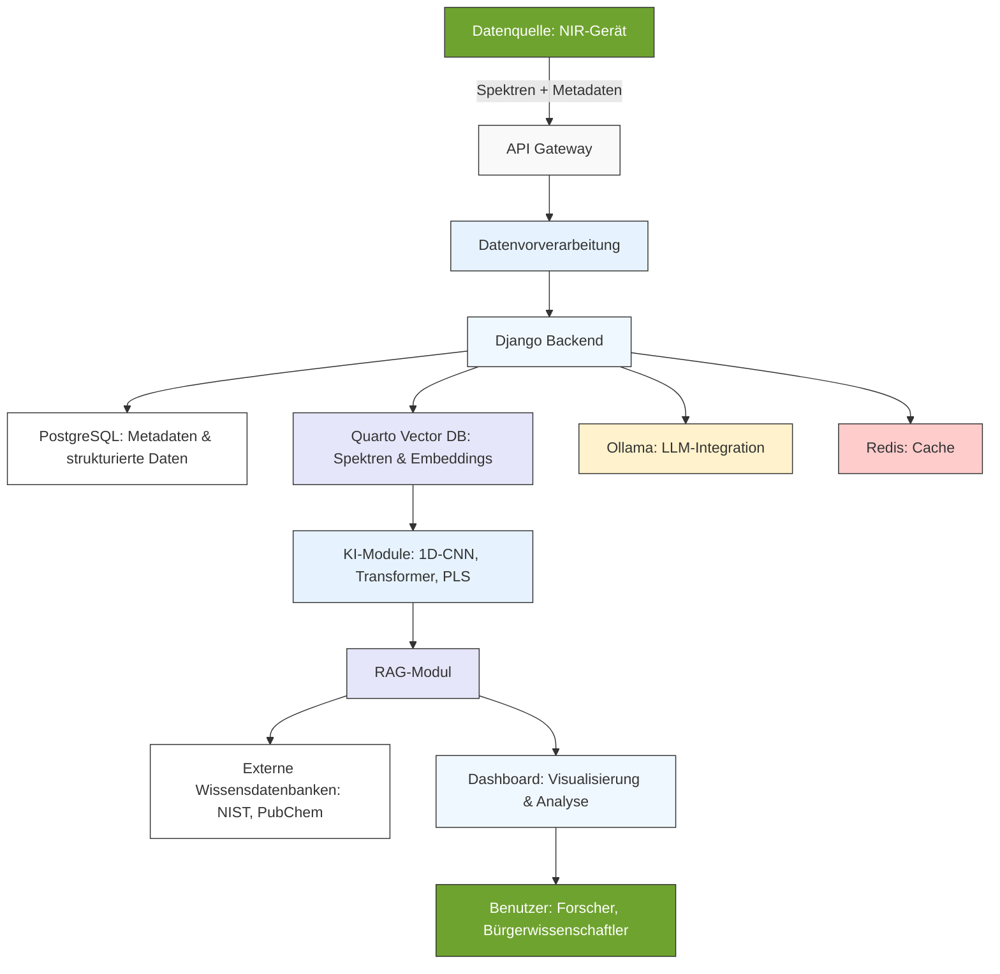

# KI und RAG in der NIR-Spektroskopie: Innovative Ansätze für Kalibration und Datenanalyse

**Martin Klausmann (OGV)**

*Kontakt: martin.klausmann@ogv.de*

---

## Zusammenfassung

Die Nahinfrarotspektroskopie (*NIR*) hat sich als eine der vielseitigsten nicht-destruktiven analytischen Methoden etabliert, die in Landwirtschaft, Umweltmonitoring und Materialwissenschaften unverzichtbar geworden ist. Trotz ihrer Fähigkeit, Echtzeitdaten kostengünstig und ohne aufwendige Probenvorbereitung zu liefern, stößt sie an Grenzen, wenn es um die Interpretation komplexer, überlappender Spektren oder die Abhängigkeit von hochwertigen Referenzdaten geht. 

Hier setzen *Künstliche Intelligenz (KI)* und *Retrieval-Augmented Generation (RAG)* an. Während traditionelle Methoden wie *Partial Least Squares (PLS)* oder *Principal Component Analysis (PCA)* bei linearen Zusammenhängen ihre Stärken ausspielen, erlauben moderne KI-Ansätze wie *1D-Convolutional Neural Network (1D-CNN)*, *Transformer* oder hybride Modelle die Bewältigung nicht-linearer, komplexer Datensätze. RAG ergänzt diese Ansätze, indem es generative KI mit externem Wissen aus Datenbanken wie *National Institute of Standards and Technology (NIST)* oder *PubChem* verbindet und so nicht nur präzisere Analysen, sondern auch nachvollziehbare Erklärungen liefert.

Dieser Artikel beleuchtet die theoretischen Grundlagen dieser Technologien, stellt die technische Architektur der *NIR_Mistral*-Plattform mit Fokus auf die genutzten Module vor und zeigt auf, wie sie die *NIR*-Spektroskopie durch Automatisierung, Interpretierbarkeit und dynamische Wissensintegration revolutionieren. Ein besonderer Fokus liegt dabei auf den zukünftigen Möglichkeiten des *Federated Learning (FL)*, das dezentrales, datenschutzkonformes maschinelles Lernen ermöglicht.

**Schlüsselwörter:** Nahinfrarotspektroskopie (*NIR*), Künstliche Intelligenz (*KI*), Retrieval-Augmented Generation (*RAG*), Kalibration, Metadaten, Bürgerwissenschaft, Federated Learning (*FL*), Quarto Vector Database (*QVDB*) 

---

## 1. Einleitung

### Hintergrund und Motivation

Die Nahinfrarotspektroskopie (*NIR*) basiert auf der Absorption von Licht im Wellenlängenbereich von 380 bis 2500 Nanometer (*nm*), wobei organische Verbindungen durch Molekülschwingungen charakteristische Absorptionsbanden erzeugen. Diese Banden entstehen durch Grundschwingungen, Oberschwingungen und Kombinationsschwingungen von Bindungen wie Kohlenstoff-Wasserstoff (*C-H*), Stickstoff-Wasserstoff (*N-H*) oder Sauerstoff-Wasserstoff (*O-H*). Die *NIR*-Spektroskopie ermöglicht so die schnelle und präzise Analyse von Materialien wie Bodenproben, Lebensmitteln oder Polymeren, ohne dass eine aufwendige Probenvorbereitung nötig wäre.

Doch trotz dieser Vorteile gibt es zentrale Herausforderungen. Die Interpretation der oft breiten und stark überlappenden Absorptionsbanden ist komplex und erfordert Fachwissen. Zudem hängt die Genauigkeit der Analysen stark von der Qualität der Referenzdaten ab, was die Reproduzierbarkeit der Ergebnisse erschwert.

> In der Bürgerwissenschaft, die immer mehr an Bedeutung gewinnt, fehlt es häufig an Standardisierung und Qualitätssicherung, was die Nachvollziehbarkeit der gesammelten Daten zusätzlich beeinträchtigt (Bonney et al., 2014).

Hier kommen *Künstliche Intelligenz (KI)* und *Retrieval-Augmented Generation (RAG)* ins Spiel. Durch die Integration von maschinellem Lernen und generativer KI können komplexe Spektren automatisiert analysiert und Kalibrationen dynamisch angepasst werden. RAG verbindet dabei die Stärken generativer Modelle mit dem Zugriff auf externe Wissensdatenbanken, um die Interpretierbarkeit und Genauigkeit der Analysen weiter zu steigern. Diese Kombination ermöglicht es, nicht nur präzisere Vorhersagen zu treffen, sondern auch die Entscheidungsprozesse der Modelle nachvollziehbar zu machen.

### Zielsetzung

Ziel dieses Artikels ist es, die Rolle von *KI* und *RAG* in der *NIR*-Spektroskopie zu untersuchen und ihre praktische Anwendung aufzuzeigen. Dabei stehen folgende Fragen im Mittelpunkt: Wie können KI-basierte Modelle die Genauigkeit und Effizienz der *NIR*-Spektroskopie verbessern? Welche Rolle spielt *RAG* bei der Interpretierbarkeit von *NIR*-Daten? Wie tragen Metadaten zur Nachvollziehbarkeit und Standardisierung bei? Und welche technischen Module werden in der *NIR_Mistral*-Plattform eingesetzt, um diese Ziele zu erreichen? Besonders beleuchtet wird auch das Potenzial von *Federated Learning (FL)* für zukünftige Anwendungen.

---

## 2. Theoretische Grundlagen

### Physikalische Prinzipien der Nahinfrarotspektroskopie (*NIR*)

Die *NIR*-Spektroskopie nutzt die Absorption von Licht im nahen Infrarotbereich von 380 bis 2500 Nanometer, um Informationen über die chemische Zusammensetzung einer Probe zu gewinnen.

> Dabei werden Molekülschwingungen angeregt, die sich als Absorptionsbanden im Spektrum manifestieren. Diese Banden sind typischerweise breit und überlappend, was die Interpretation erschwert (Workman, 2016).

Daher ist die Kalibration – also die Erstellung eines Modells, das die Beziehung zwischen den Spektren und den gewünschten Eigenschaften beschreibt – von zentraler Bedeutung.

### Traditionelle Methoden der *NIR*-Datenanalyse

Traditionell kommen statistische Methoden wie *Partial Least Squares (PLS)* oder *Principal Component Analysis (PCA)* zum Einsatz.

> *PLS* ist eine lineare Regressionsmethode, die die Beziehung zwischen Spektren und Eigenschaften wie Feuchtigkeitsgehalt oder Nährstoffkonzentrationen modelliert. *PCA* reduziert die Dimensionalität der Daten, indem Hauptkomponenten extrahiert werden, was die Visualisierung und Rauschunterdrückung erleichtert (Lütjohann & Theis, 2021).

*Support Vector Machines (SVM)* eignen sich besonders für nicht-lineare Daten, sind jedoch rechenintensiv und schwer interpretierbar. Diese Methoden stoßen jedoch an Grenzen, wenn es um komplexe, nicht-lineare Zusammenhänge oder große Datensätze geht. Hier können KI-basierte Ansätze Abhilfe schaffen.

### KI-basierte Methoden für die *NIR*-Spektroskopie

KI-basierte Methoden nutzen maschinelles Lernen und Deep Learning, um komplexe Muster in *NIR*-Spektren zu erkennen. Beim überwachten Lernen kommen Klassifikationsmodelle wie *Random Forest* oder *Support Vector Machines (SVM)* zum Einsatz, um Materialien zu identifizieren. Für quantitative Analysen, etwa die Bestimmung des Feuchtigkeitsgehalts, werden Regressionsmodelle wie *PLS* oder *1D-Convolutional Neural Network (1D-CNN)* verwendet.

Unüberwachtes Lernen nutzt Clusteranalysen wie *PCA* oder *t-Distributed Stochastic Neighbor Embedding (t-SNE)*, um ähnliche Spektren zu gruppieren und Muster in den Daten zu erkennen.

> Ein besonderes Merkmal ist die Nutzung von *Federated Learning (FL)*, das es ermöglicht, Modelle dezentral zu trainieren, ohne dass die Daten zentral gespeichert werden müssen. Dies ist besonders für die Bürgerwissenschaft von Vorteil, da es den Datenschutz gewährleistet und gleichzeitig die Kollaboration zwischen verschiedenen Nutzern fördert (Flower Framework, 2024).

### *Retrieval-Augmented Generation (RAG)*

*Retrieval-Augmented Generation (RAG)* ist ein innovativer Ansatz, der generative KI mit externen Wissensdatenbanken verbindet.

> Der Prozess läuft in zwei Schritten ab: Zuerst wird relevantes Wissen aus einer Datenbank abgerufen, etwa aus chemischen Datenbanken wie *National Institute of Standards and Technology (NIST)* oder *PubChem*, und anschließend nutzt das generative Modell diese Informationen, um eine kontextualisierte Antwort zu erstellen (Lewis et al., 2023).

*RAG* bietet mehrere Vorteile für die *NIR*-Spektroskopie. Es verbessert die Interpretierbarkeit, indem es Erklärungen für Klassifikationen oder Vorhersagen liefert. Zudem ermöglicht es die dynamische Integration von neuem Wissen, etwa aktuelle Forschungsergebnisse oder neue Materialdaten. Durch den Abgleich mit externen Datenbanken reduziert *RAG* auch die Gefahr von Halluzinationen, also falschen oder erfundenen Informationen, die bei rein generativen Ansätzen auftreten können.

---

## 3. Technische Architektur der *NIR_Mistral*-Plattform

### Systemüberblick

Die *NIR_Mistral*-Plattform ist modular aufgebaut und nutzt eine Kombination aus Open-Source- und spezialisierten Tools, um Skalierbarkeit, Flexibilität und Nachvollziehbarkeit zu gewährleisten. Im Zentrum steht das *Django*-Backend, das als zentrale Steuerungseinheit fungiert und die Kommunikation zwischen den verschiedenen Modulen koordiniert. Für die Speicherung strukturierter Daten und Metadaten kommt *PostgreSQL* zum Einsatz, während *Quarto Vector Database (QVDB)* als Vektordatenbank für die effiziente Speicherung und Abfrage von *NIR*-Spektren und Embeddings dient. *Ollama* ermöglicht die lokale Integration von *Large Language Models (LLM)* für generative Aufgaben, und *Redis* dient als Cache, um häufig abgerufene Daten schnell bereitzustellen und die Performance der Plattform zu optimieren.

Die KI-Module, zu denen *1D-Convolutional Neural Network (1D-CNN)*, *Transformer* und *Partial Least Squares (PLS)* gehören, sind für die Analyse und Modellierung der Spektren zuständig. Das *Retrieval-Augmented Generation (RAG)*-Modul verbindet diese Analysen mit externem Wissen aus Datenbanken wie *NIST* oder *PubChem*, um kontextualisierte und nachvollziehbare Ergebnisse zu liefern. Das Dashboard schließlich bietet eine intuitive Benutzeroberfläche für die Echtzeit-Analyse und Visualisierung der Daten.

*Systemarchitektur der NIR_Mistral-Plattform: Von der Datenerfassung bis zur Analyse mit KI und Retrieval-Augmented Generation.*

### Kernmodule und deren Funktionen

#### *Django* als Backend

*Django* bildet das Herzstück der *NIR_Mistral*-Plattform und übernimmt die zentrale Steuerung aller Prozesse. Als Python-basiertes Webframework ist es für die Bereitstellung der *Restful Application Programming Interface (API)*, die Datenbankverwaltung und die Nutzerauthentifizierung verantwortlich.

> *Django* wurde aufgrund seiner Reife, Sicherheit und Skalierbarkeit gewählt, was es ideal für den Einsatz in einer Produktionsumgebung macht (Docker Inc., 2023).

Es ermöglicht nicht nur die Verwaltung von Nutzern und Daten, sondern auch die Orchestrierung der Kommunikation zwischen den verschiedenen Modulen wie den Datenbanken, den KI-Modellen und dem *Retrieval-Augmented Generation (RAG)*-Modul.

Ein besonderer Vorteil von *Django* ist seine modulare Architektur, die es ermöglicht, neue Funktionen einfach zu integrieren. So können etwa neue KI-Modelle oder Datenbanken ohne großen Aufwand hinzugefügt werden. Zudem bietet *Django* eine robuste Basis für die Validierung von Daten, was besonders bei der Erfassung von Metadaten und Spektren von Bedeutung ist.

#### *PostgreSQL* für Metadaten

*PostgreSQL* wird als relationale Datenbank für die Speicherung strukturierter Daten und Metadaten genutzt. Es übernimmt die Verwaltung aller deskriptiven, strukturellen, administrativen, technischen und Qualitätsmetadaten, die für die Nachvollziehbarkeit der *NIR*-Analysen essenziell sind.

> Durch seine Fähigkeit, komplexe Beziehungen zwischen Daten abzubilden, ermöglicht *PostgreSQL* schnelle und effiziente Abfragen, etwa nach Ort, Gerätetyp oder Material (Allot et al., 2021).

Ein wichtiger Vorteil von *PostgreSQL* ist seine Unterstützung für *JavaScript Object Notation (JSON)*/*JSONB*-Spalten, was die Speicherung von semi-strukturierten Metadaten erleichtert. Zudem bietet es erweiterte Indexierungsmöglichkeiten, die schnelle Abfragen auch bei großen Datenmengen ermöglichen.

#### *Quarto Vector Database (QVDB)* als Vektordatenbank

*Quarto Vector Database (QVDB)* ist eine der zentralen Komponenten der *NIR_Mistral*-Plattform und ersetzt die bisher genutzte Weaviate-Datenbank. Als Vektordatenbank ist sie speziell für die Speicherung und Abfrage von *NIR*-Spektren als hochdimensionale Vektoren optimiert. Jedes Spektrum wird dabei als Vektor repräsentiert, der die Absorptionswerte über den gesamten Wellenlängenbereich von 380 bis 2500 Nanometer abbildet. Dies ermöglicht eine effiziente Similaritätssuche, bei der ähnliche Spektren basierend auf ihrer Vektorähnlichkeit gefunden werden.

> Ein entscheidender Vorteil von *QVDB* ist ihre Optimierung für wissenschaftliche Anwendungen, insbesondere für die Spektroskopie. Sie unterstützt *Approximate Nearest Neighbor (ANN)*-Algorithmen wie *Hierarchical Navigable Small World (HNSW)* oder *Inverted File (IVF)*, die eine schnelle und skalierbare Suche auch in großen Datensätzen ermöglichen (Quarto Vector Database, 2024).

Ein weiterer Vorteil ist die nahtlose Integration mit *Quarto*, das für die Dokumentation und Visualisierung der Daten genutzt wird.

*QVDB* speichert nicht nur die *NIR*-Spektren als Vektoren, sondern auch Embeddings für die Integration mit dem *Retrieval-Augmented Generation (RAG)*-Modul. Diese Embeddings ermöglichen es, chemische Eigenschaften oder Beschreibungen von Spektren in einer Form zu speichern, die für die Similaritätssuche und das Retrieval von externem Wissen genutzt werden kann.

#### *Ollama* für lokale *Large Language Model (LLM)*-Integration

*Ollama* ermöglicht die lokale Integration von *Large Language Models (LLM)* in die *NIR_Mistral*-Plattform. Dies ist besonders wichtig, um Datenschutz und Offline-Fähigkeit zu gewährleisten, da die Daten nicht in die Cloud übertragen werden müssen.

> *Ollama* unterstützt verschiedene Modelle wie Llama 2 oder Mistral, die je nach Anforderung ausgetauscht werden können (Ollama, 2024).

Die Hauptfunktionen von *Ollama* in der Plattform umfassen die Generierung von Beschreibungen für Spektren oder Analysen, die Verarbeitung von Nutzeranfragen in natürlicher Sprache und die Unterstützung des *Retrieval-Augmented Generation (RAG)*-Moduls bei der Erstellung von Erklärungen.

Ein weiterer Vorteil von *Ollama* ist seine einfache *Application Programming Interface (API)*, die eine nahtlose Integration in die Plattform ermöglicht. Zudem ermöglicht es den lokalen Betrieb von *LLM* auf Standard-Hardware, was die Kosten reduziert und die Flexibilität erhöht.

#### *Redis* für Performance-Optimierung

*Redis* dient als In-Memory-Datenbank für das Caching häufig abgerufener Daten. Es übernimmt die Zwischenspeicherung von Spektren und Metadaten, um die Last auf *PostgreSQL* und *Quarto Vector Database (QVDB)* zu reduzieren und die Performance der Plattform zu steigern.

> Zudem wird *Redis* für das Session-Management und das Rate Limiting genutzt, um die *Application Programming Interface (API)* vor Überlastung zu schützen (Redis Documentation, 2023).

Ein entscheidender Vorteil von *Redis* sind seine extrem niedrigen Latenzzeiten im Mikrosekundenbereich, was es ideal für Echtzeit-Anforderungen macht. Es kann horizontal skaliert werden, um mit einer wachsenden Nutzerzahl Schritt zu halten, und trägt so dazu bei, dass das Dashboard und die *API* auch bei hoher Auslastung schnell reagieren.

#### KI-Module: *1D-Convolutional Neural Network (1D-CNN)*, *Transformer* und *Partial Least Squares (PLS)*

Die KI-Module sind das Herzstück der Datenanalyse in der *NIR_Mistral*-Plattform. Sie kommen in verschiedenen Phasen des Workflows zum Einsatz, von der Vorverarbeitung bis zur finalen Klassifikation oder Regression.

Das *1D-Convolutional Neural Network (1D-CNN)* ist speziell für die Analyse sequentieller Daten wie *NIR*-Spektren optimiert.

> Es kann lokale Muster wie Peaks oder Täler in den Spektren erkennen und ist besonders robust gegen Rauschen, was es ideal für die Analyse von *NIR*-Daten macht (Cen & He, 2020).

Durch seine Fähigkeit, räumliche Beziehungen zwischen den Wellenlängen zu erhalten, kann es komplexe Zusammenhänge in den Spektren erkennen, die für traditionelle Methoden unsichtbar bleiben.

Der *Transformer* ist ein weiteres leistungsstarkes KI-Modell, das in der Plattform eingesetzt wird. Im Gegensatz zum *1D-CNN*, das sich auf lokale Muster konzentriert, kann der *Transformer* globale Abhängigkeiten in den Spektren erkennen.

> Durch seinen Attention-Mechanismus kann er sich auf relevante Wellenlängenbereiche fokussieren und so besonders komplexe, nicht-lineare Zusammenhänge modellieren (Goodfellow et al., 2016).

Dies macht ihn ideal für Aufgaben, bei denen die Beziehungen zwischen weit auseinanderliegenden Wellenlängen von Bedeutung sind.

*Partial Least Squares (PLS)* ist ein klassisches, aber nach wie vor wichtiges Verfahren in der *NIR*-Spektroskopie. Als lineare Regressionsmethode ist es besonders für kleine Datensätze und für die Modellierung linearer Zusammenhänge geeignet.

> Ein großer Vorteil von *PLS* ist seine Interpretierbarkeit, da die Beziehung zwischen den Wellenlängen und den vorhergesagten Eigenschaften klar nachvollziehbar ist (Pasquini, 2018).

In der *NIR_Mistral*-Plattform werden diese Modelle oft in hybriden Ansätzen kombiniert. So kann etwa *PLS* zunächst wichtige Wellenlängenbereiche extrahieren, die dann von einem *1D-CNN* oder *Transformer* für die finale Klassifikation oder Regression genutzt werden.

> Dies vereint die Vorteile beider Welten: die Interpretierbarkeit von *PLS* und die Leistungsfähigkeit moderner KI-Modelle (Li et al., 2022).

#### *Retrieval-Augmented Generation (RAG)*-Modul für kontextualisierte Antworten

Das *Retrieval-Augmented Generation (RAG)*-Modul ist eine der innovativsten Komponenten der *NIR_Mistral*-Plattform. Es verbindet die Ergebnisse der KI-Module mit externem Wissen aus Datenbanken wie *National Institute of Standards and Technology (NIST)*, *PubChem* oder der *United States Department of Agriculture (USDA) Grain Database*, um kontextualisierte und nachvollziehbare Antworten zu generieren.

Der Workflow des *RAG*-Moduls sieht wie folgt aus: Zuerst wird eine Anfrage des Nutzers verarbeitet, etwa die Klassifikation eines Spektrums. Das Retrieval-Modul durchsucht dann externe Datenbanken nach ähnlichen Spektren oder chemischen Informationen, die für die Interpretation der Ergebnisse relevant sein könnten. Diese Informationen werden dann mit den Ergebnissen der KI-Module kombiniert, und *Ollama* generiert eine finale Antwort, die sowohl die Analyseergebnisse als auch den Kontext aus den externen Datenbanken enthält.

Ein entscheidender Vorteil von *RAG* ist, dass es die Interpretierbarkeit der Ergebnisse deutlich verbessert. Statt nur eine Klassifikation wie „Polyethylenterephthalat (*PET*)-Kunststoff“ zu liefern, kann das System nun erklären, warum diese Klassifikation getätigt wurde:

> *„Die Klassifikation basiert auf den Absorptionsbanden bei 1715 Nanometer (Kohlenstoff-Sauerstoff-Streckschwingung) und 1240 Nanometer (Kohlenstoff-Sauerstoff-Streckschwingung), die typisch für Polyethylenterephthalat sind. Laut der *National Institute of Standards and Technology (NIST)*-Datenbank zeigen *PET*-Proben genau diese Banden. Zudem deutet die Intensität der Bande bei 1715 Nanometer auf einen hohen Kristallinitätsgrad hin.“*

Ein weiterer Vorteil von *RAG* ist die Reduzierung von Halluzinationen. Durch den Abgleich mit externen Datenbanken wird sichergestellt, dass die generierten Antworten auf tatsächlichen Informationen basieren und nicht auf erfundenen oder falschen Annahmen.

#### Dashboard für Echtzeit-Analyse

Das Dashboard ist die Benutzeroberfläche der *NIR_Mistral*-Plattform und bietet eine intuitive Möglichkeit, Daten zu explorieren und zu analysieren.

> Es ermöglicht Nutzern, *NIR*-Spektren und Metadaten hochzuladen, Echtzeit-Analysen durchzuführen und die Ergebnisse in interaktiven Diagrammen zu visualisieren.

Zu den Hauptfunktionen des Dashboards gehören der Upload von Daten, die Filterung und Suche nach bestimmten Kriterien wie Ort, Gerätetyp oder Material, sowie die Visualisierung der Ergebnisse. Dabei kommen Tools wie *Plotly* zum Einsatz, um interaktive und ansprechende Diagramme zu erstellen, etwa Spektrenvergleiche, *Principal Component Analysis (PCA)*-Plots oder Klassifikationsergebnisse.

Ein besonderer Fokus liegt auf der Integration des *Retrieval-Augmented Generation (RAG)*-Moduls in das Dashboard. Nutzer erhalten nicht nur die Ergebnisse der KI-Analysen, sondern auch detaillierte Erklärungen, die auf externem Wissen basieren. Dies macht die Plattform besonders benutzerfreundlich und nachvollziehbar, selbst für Nutzer ohne tiefgehendes technisches Wissen.

*Quarto* wird für das Dashboard genutzt, da es interaktive Berichte mit *R*, *Python* und *Observable JavaScript* unterstützt und eine einfache Integration mit den anderen Modulen der Plattform bietet.

> Zudem ist es offline-fähig, was es ideal für den Einsatz in der Feldforschung macht (Quarto Documentation, 2023).

### Workflow der Datenanalyse

Der typische Workflow in der *NIR_Mistral*-Plattform ist in der folgenden Grafik dargestellt und läuft in mehreren Schritten ab, von der Datenerfassung bis zur Ausgabe der Ergebnisse.

```mermaid
flowchart LR
    subgraph Datenerfassung
        A[NIR-Gerät] -->|Spektrum| B[Metadaten-Erfassung]
        B --> C[Geräte-ID, GPS, Datum]
    end
    
    subgraph Vorverarbeitung
        C --> D[Baseline-Korrektur: Savitzky-Golay]
        D --> E[Normalisierung: Min-Max]
        E --> F[Rauschunterdrückung: Wavelet]
    end
    
    subgraph Speicherung
        F --> G[PostgreSQL: Metadaten]
        F --> H[Quarto Vector DB: Spektrum als Vektor]
    end
    
    subgraph Analyse
        H --> I[1D-CNN: Klassifikation]
        H --> J[Transformer: Regression]
        H --> K[PLS: Quantitative Analyse]
        I --> L[RAG: Abruf aus NIST/PubChem]
        L --> M[Ollama: Erklärung generieren]
    end
    
    subgraph Ausgabe
        M --> N[Dashboard: Visualisierung]
        N --> O[Quarto Reports: PDF/HTML]
        N --> P[Originaldaten: CSV/JSON]
        N --> Q[Kalibrierung: Modellparameter]
        Q --> O
        O --> R[Benutzer: Forscher, Bürgerwissenschaftler]
    end
    
    style A fill:#6FA32F,stroke:#333,color:#fff
    style B fill:#e6f3ff,stroke:#333
    style C fill:#e6f3ff,stroke:#333
    style D fill:#f0f8ff,stroke:#333
    style E fill:#f0f8ff,stroke:#333
    style F fill:#f0f8ff,stroke:#333
    style G fill:#fff,stroke:#333
    style H fill:#e6e6fa,stroke:#333
    style I fill:#e6f3ff,stroke:#333
    style J fill:#e6f3ff,stroke:#333
    style K fill:#e6f3ff,stroke:#333
    style L fill:#e6e6fa,stroke:#333
    style M fill:#fff2cc,stroke:#333
    style N fill:#f0f8ff,stroke:#333
    style O fill:#e6e6fa,stroke:#333
    style P fill:#fff,stroke:#333
    style Q fill:#fff,stroke:#333
    style R fill:#6FA32F,stroke:#333,color:#fff
```

*Detaillierter Workflow: Von der Datenerfassung bis zur Ausgabe von Ergebnissen, Erklärungen, Quarto Reports, Originaldaten und Kalibrierung.*

Der Prozess beginnt mit der Datenerfassung, bei der ein *NIR*-Gerät ein Spektrum im Bereich von 380 bis 2500 Nanometer misst. Gleichzeitig werden Metadaten erfasst, die sowohl automatisch (z. B. Geräte-Identifikationsnummer, Messdatum, *Global Positioning System (GPS)*-Koordinaten) als auch manuell (z. B. Probenname, Materialtyp) erhoben werden.

> Diese Metadaten sind essenziell für die spätere Nachvollziehbarkeit und Interpretierbarkeit der Ergebnisse (Allot et al., 2021).

Im nächsten Schritt wird das Spektrum vorverarbeitet. Dabei kommen Techniken wie die Baseline-Korrektur durch *Savitzky-Golay* oder *Wavelet*-Transformationen zum Einsatz, um Untergrundrauschen zu entfernen. Anschließend wird das Spektrum normalisiert, etwa durch *Min-Max*-Skalierung, um es mit anderen Spektren vergleichbar zu machen. Rauschunterdrückung durch Filterung oder *Fourier*-Transformationen rundet die Vorverarbeitung ab.

Die vorverarbeiteten Daten werden dann in den jeweiligen Datenbanken gespeichert. Während die Metadaten in *PostgreSQL* abgelegt werden, wird das Spektrum als Vektor in *Quarto Vector Database (QVDB)* gespeichert.

> Dies ermöglicht eine effiziente Similaritätssuche und die spätere Integration mit dem *Retrieval-Augmented Generation (RAG)*-Modul (Quarto Vector Database, 2024).

In der Analysephase kommen die KI-Module zum Einsatz. *1D-Convolutional Neural Network (1D-CNN)*, *Transformer* und *Partial Least Squares (PLS)* analysieren das Spektrum und liefern Klassifikationen oder Vorhersagen. Das *Retrieval-Augmented Generation (RAG)*-Modul durchsucht dann externe Datenbanken nach ähnlichen Spektren oder chemischen Informationen, die für die Interpretation der Ergebnisse relevant sein könnten. *Ollama* generiert schließlich eine Erklärung, die sowohl die Analyseergebnisse als auch den Kontext aus den externen Datenbanken enthält.

Abschließend werden die Ergebnisse im Dashboard visualisiert und in verschiedenen Formaten ausgegeben. Der Nutzer erhält nicht nur die Klassifikation oder Vorhersage, sondern auch eine detaillierte Erklärung, die auf den Ergebnissen der KI-Module und den abgerufenen Informationen basiert. Zusätzlich werden die Ergebnisse als *Quarto Reports* in *Portable Document Format (PDF)* oder *HyperText Markup Language (HTML)* ausgegeben, um eine einfache Weiterverarbeitung und Dokumentation zu ermöglichen. Die Originaldaten können dabei als *Comma-Separated Values (CSV)* oder *JavaScript Object Notation (JSON)* heruntergeladen werden, um eine weitere Analyse oder Integration in andere Systeme zu erleichtern.

> Zudem werden die Kalibrierungsparameter des Modells bereitgestellt, um die Reproduzierbarkeit der Analysen zu gewährleisten und eine Anpassung der Modelle an neue Daten zu ermöglichen (Stodden et al., 2018).

---

## 4. Praktische Anwendungen

### Landwirtschaft

In der Landwirtschaft bietet die *NIR*-Spektroskopie vielfältige Anwendungsmöglichkeiten, die durch *KI* und *Retrieval-Augmented Generation (RAG)* weiter verbessert werden können. Ein zentrales Anwendungsfeld ist die Bodenanalyse, bei der *NIR*-Spektren genutzt werden, um den Nährstoffgehalt wie Stickstoff, Phosphor oder Kalium zu bestimmen.

> Diese Informationen sind entscheidend für die Optimierung der Düngemittelanwendung und die Verbesserung der Erträge (Huang et al., 2021).

Ein Landwirt kann etwa *NIR*-Spektren von Bodenproben messen und ein hybrides Modell aus *Partial Least Squares (PLS)* und *1D-Convolutional Neural Network (1D-CNN)* nutzen, um den Stickstoffgehalt vorherzusagen. Durch die Integration von *RAG* kann das System zusätzlich Empfehlungen für die Düngemittelanwendung liefern, die auf externen Datenbanken wie Bodenkarten oder Wetterdaten basieren.

Ein weiteres wichtiges Anwendungsgebiet ist die Qualitätskontrolle von Erntegut. Hier können *NIR*-Spektren genutzt werden, um Schädlinge, Krankheiten oder Verunreinigungen in Pflanzen zu erkennen.

> Durch die Integration von Metadaten wie Pflanzenart, Anbaubedingungen oder Erntedatum kann die Genauigkeit der Vorhersagen weiter gesteigert werden.

In einer Studie von Huang et al. (2021) wurde ein *1D-CNN*-Modell für die Proteinbestimmung in Weizen eingesetzt.

> Durch die Integration von *RAG* konnte die Genauigkeit der Vorhersage von einem *Root Mean Square Error of Prediction (RMSEP)* von 0,21 % auf 0,08 % reduziert werden, was die Effektivität dieser Kombination unter Beweis stellt.

### Lebensmittelindustrie

In der Lebensmittelindustrie wird die *NIR*-Spektroskopie für die Qualitätskontrolle und Sicherheit eingesetzt. Sie ermöglicht etwa die Bestimmung von Fett-, Protein- und Laktosegehalt in Milch oder die Messung von Feuchtigkeit, Fettgehalt und Frische in Fleisch.

> Zudem kann sie Verfälschungen erkennen, etwa bei Olivenöl, das mit billigeren Ölen gestreckt wurde (Cen & He, 2020).

Ein Lebensmittelproduzent könnte ein hybrides Modell aus *Partial Least Squares (PLS)* und *Transformer* nutzen, um die Qualität von Milchproben zu analysieren. Durch *Retrieval-Augmented Generation (RAG)* kann das System zusätzlich Hinweise auf mögliche Verfälschungen liefern, die auf externen Datenbanken wie *National Institute of Standards and Technology (NIST)* oder *PubChem* basieren.

> Dies ermöglicht nicht nur eine präzisere Analyse, sondern auch eine nachvollziehbare Erklärung der Ergebnisse, was für die Qualitätssicherung und Compliance von großer Bedeutung ist (Goodfellow et al., 2016).

---

## 5. Diskussion

### Vorteile der genutzten Module

Die Kombination der in der *NIR_Mistral*-Plattform genutzten Module bietet synergetische Vorteile, die die Plattform einzigartig machen. *Django* als Backend stellt eine robuste und skalierbare Basis bereit, die nicht nur die Verwaltung von Nutzern und Daten ermöglicht, sondern auch die Orchestrierung der Kommunikation zwischen den verschiedenen Modulen übernimmt. *PostgreSQL* und *Quarto Vector Database (QVDB)* ergänzen sich ideal: Während *PostgreSQL* die strukturierten Metadaten verwaltet und schnelle relationale Abfragen ermöglicht, übernimmt *QVDB* die effiziente Speicherung und Suche von Spektren als Vektoren.

> Dies ermöglicht eine nahtlose Integration von Metadaten und Spektren, die für die Nachvollziehbarkeit und Interpretierbarkeit der Ergebnisse essenziell ist (Allot et al., 2021).

*Ollama* und das *Retrieval-Augmented Generation (RAG)*-Modul arbeiten eng zusammen, um kontextualisierte und nachvollziehbare Antworten zu generieren. Während *Ollama* die generativen Fähigkeiten bereitstellt, sorgt das *RAG*-Modul dafür, dass die generierten Antworten auf tatsächlichen Informationen aus externen Datenbanken basieren.

> Dies reduziert nicht nur Halluzinationen, sondern verbessert auch die Interpretierbarkeit der Ergebnisse deutlich (Lewis et al., 2023).

Die KI-Module – *1D-Convolutional Neural Network (1D-CNN)*, *Transformer* und *Partial Least Squares (PLS)* – decken ein breites Spektrum an Anwendungsfällen ab. Während *1D-CNN* und *Transformer* komplexe, nicht-lineare Zusammenhänge erkennen können, bietet *PLS* eine interpretierbare und robuste Methode für lineare Zusammenhänge.

> Die Kombination dieser Modelle in hybriden Ansätzen vereint die Vorteile beider Welten und ermöglicht so präzisere und nachvollziehbare Analysen (Li et al., 2022).

*Redis* schließlich sorgt dafür, dass die Plattform auch bei hoher Auslastung schnell und effizient bleibt. Durch das Caching häufig abgerufener Daten reduziert es die Last auf die Datenbanken und beschleunigt die Antwortzeiten für Nutzer.

### Herausforderungen und Lösungen

Trotz der vielen Vorteile gibt es Herausforderungen, die bei der Integration dieser Module berücksichtigt werden müssen. Eine der größten Herausforderungen ist die Datenkonsistenz zwischen *PostgreSQL* und *Quarto Vector Database (QVDB)*. Da Metadaten in *PostgreSQL* und Spektren in *QVDB* gespeichert werden, müssen diese synchron gehalten werden.

> Die *NIR_Mistral*-Plattform löst dies durch transaktionale Integrität in *Django*: Änderungen werden nur in beiden Datenbanken bestätigt, wenn alle Validierungen erfolgreich sind (Docker Inc., 2023).

Ein weiteres Problem ist die Performance bei großen Datenmengen. Vektorsuchen in *QVDB* können bei Millionen von Einträgen langsam werden. Hier kommen *Approximate Nearest Neighbor (ANN)*-Algorithmen wie *Hierarchical Navigable Small World (HNSW)* oder *Inverted File (IVF)* zum Einsatz, die eine schnelle und skalierbare Suche auch in großen Datensätzen ermöglichen.

> Zudem kann die Datenbank partitioniert werden, etwa nach Projekten oder Materialtypen, um die Performance weiter zu steigern.

Der Ressourcenbedarf von *Ollama* stellt eine weitere Herausforderung dar. Große *Large Language Models (LLM)* wie *Mistral 7B* benötigen viel *Random Access Memory (RAM)*, was den lokalen Betrieb auf Standard-Hardware erschweren kann.

> Hier bietet *Ollama* die Möglichkeit, kleinere Modelle wie *Llama 2 7B* zu nutzen oder die Modelle durch Quantisierung zu komprimieren, ohne dabei zu viel an Genauigkeit zu verlieren (Ollama, 2024).

Die Integration externer Datenbanken ist ebenfalls mit Herausforderungen verbunden. Externe Datenbanken wie *National Institute of Standards and Technology (NIST)* oder *PubChem* haben unterschiedliche *Application Programming Interfaces (API)* und Datenformate, was die Integration erschweren kann.

> Die *NIR_Mistral*-Plattform nutzt hier Adapter-Module im *Retrieval-Augmented Generation (RAG)*-Modul, die die Daten standardisieren und in ein einheitliches Format wie *JavaScript Object Notation for Linked Data (JSON-LD)* umwandeln (SpectraRAG, 2024).

Schließlich kann die Echtzeitfähigkeit von *Retrieval-Augmented Generation (RAG)* eine Herausforderung darstellen. Retrieval und Generierung können Latenzzeiten einführen, was die Nutzererfahrung beeinträchtigen kann.

> Hier kommen Caching-Mechanismen in *Redis* zum Einsatz, die häufige Anfragen zwischenspeichern und so die Antwortzeiten verkürzen (Redis Documentation, 2023).

### *Internet of Things (IoT)* und DIY-Spektroskopie

Ein besonders spannendes Anwendungsfeld für die *NIR_Mistral*-Plattform ist die Integration mit *Internet of Things (IoT)*-Geräten und *Do-It-Yourself (DIY)*-Spektroskopie-Lösungen. Ein Beispiel hierfür ist die Nutzung kostengünstiger *NIR*-Kameras auf Basis von Mikrocontrollern wie der *ESP32*. Solche Geräte ermöglichen es, *NIR*-Spektren direkt vor Ort zu erfassen und zu analysieren, ohne auf teure Laborausrüstung angewiesen zu sein.

*Beispiel eines DIY-NIR-Spektrometers auf Basis eines Smartphones und eines 3D-gedruckten Gehäuses.*

Die Messqualität solcher *DIY*-Lösungen, insbesondere mit *ESP32*-basierten *NIR*-Kameras, hängt stark von mehreren Faktoren ab. Zunächst ist die **Qualität der Sensoren** entscheidend.

> *ESP32*-Kameras verwenden oft kostengünstige *NIR*-Sensoren, die im Vergleich zu professionellen Geräten wie denen von *Bruker* oder *Thermo Fisher* eine geringere Auflösung und ein höheres Rauschen aufweisen können (Workman, 2016).

Dennoch können sie für viele Anwendungen, insbesondere in der Bürgerwissenschaft oder im Bildungsbereich, ausreichend präzise Ergebnisse liefern.

Ein weiterer wichtiger Faktor ist die **Kalibrierung**.

> *DIY*-Spektrometer müssen regelmäßig kalibriert werden, um sicherzustellen, dass die gemessenen Spektren mit Referenzdaten vergleichbar sind. Hier kann die *NIR_Mistral*-Plattform unterstützen, indem sie **automatisierte Kalibrierungsprozesse** bereitstellt, die auf den gesammelten Daten basieren (Stodden et al., 2018).

Durch die Nutzung von *Federated Learning (FL)* können dabei Kalibrierungsmodelle dezentral trainiert und angepasst werden, ohne dass die Rohdaten die Geräte verlassen müssen.

Auch die **Datenvorverarbeitung** spielt eine zentrale Rolle.

> *DIY*-Spektrometer sind oft anfälliger für Störfaktoren wie Umgebungslicht oder Temperaturschwankungen. Die *NIR_Mistral*-Plattform bietet hier Techniken wie *Baseline-Korrektur* und *Rauschunterdrückung*, um die Datenqualität zu verbessern (Lütjohann & Theis, 2021).

Durch die Integration von *KI*-Modellen können zudem **Anomalien** in den Daten erkannt und korrigiert werden, was die Zuverlässigkeit der Analysen weiter erhöht.

Ein besonderer Vorteil von *IoT*-basierten *NIR*-Lösungen ist ihre **Mobilität und Flexibilität**.

> Durch die Nutzung von Mikrocontrollern wie der *ESP32* können *NIR*-Spektrometer in verschiedenen Umgebungen eingesetzt werden, etwa in der Feldforschung, in der Landwirtschaft oder im Umweltmonitoring. Die *NIR_Mistral*-Plattform unterstützt dabei nicht nur die **Datenanalyse**, sondern auch die **Dokumentation** und **Visualisierung** der Ergebnisse, was die Nutzung solcher Geräte weiter vereinfacht.

Zusammenfassend bietet die Kombination von *IoT*-Geräten wie *ESP32*-basierten *NIR*-Kameras mit der *NIR_Mistral*-Plattform ein enormes Potenzial für die Demokratisierung der *NIR*-Spektroskopie.

> Durch die Nutzung von *KI*, *RAG* und *Federated Learning (FL)* können auch kostengünstige, mobile Lösungen präzise und nachvollziehbare Analysen liefern (Bonney et al., 2014).

Dies eröffnet neue Möglichkeiten für die Bürgerwissenschaft, die Bildung und den Einsatz in abgelegenen Gebieten, in denen der Zugang zu professioneller Laborausrüstung begrenzt ist.

---

## 6. Schlussfolgerung und Ausblick

### Zusammenfassung

Die *NIR_Mistral*-Plattform zeigt, wie durch die kombinierte Nutzung von *KI*, *Retrieval-Augmented Generation (RAG)* und einer durchdachten modularen Architektur die *NIR*-Spektroskopie revolutioniert werden kann.

> *Quarto Vector Database (QVDB)* spielt dabei eine zentrale Rolle als Vektordatenbank für Spektren und Embeddings, während *Django*, *PostgreSQL*, *Ollama* und *Redis* die notwendige Infrastruktur für Skalierbarkeit, Performance und Benutzerfreundlichkeit bereitstellen (Quarto Vector Database, 2024).

Durch die Integration von Metadaten als Grundpfeiler für die Nachvollziehbarkeit können reproduzierbare, transparente und skalierbare Analysen ermöglicht werden.

Die Plattform verbindet die Vorteile moderner *KI*-Modelle mit der Interpretierbarkeit und Nachvollziehbarkeit, die durch *RAG* und Metadaten erreicht wird.

> Dies macht sie nicht nur für Forscher, sondern auch für Bürgerwissenschaftler und Industriepartner attraktiv (Leek & Peng, 2015).

Die Möglichkeit, komplexe Spektren automatisiert zu analysieren und gleichzeitig nachvollziehbare Erklärungen zu liefern, öffnet neue Türen für die Anwendung der *NIR*-Spektroskopie in verschiedenen Bereichen.

### Ausblick

Für die Zukunft sind eine Reihe von Erweiterungen und Verbesserungen geplant, die die Funktionalität und Benutzerfreundlichkeit der *NIR_Mistral*-Plattform weiter steigern sollen. Ein zentrales Ziel ist die Erweiterung von *Quarto Vector Database (QVDB)* um *NIR*-spezifische Embeddings, die die Similaritätssuche und das *Retrieval* weiter verbessern.

> Dies könnte etwa durch vorab trainierte Modelle für Spektren erreicht werden, die speziell auf die Anforderungen der *NIR*-Spektroskopie zugeschnitten sind.

Ein weiteres Ziel ist der Einsatz der Plattform auf *Internet of Things (IoT)*-Geräten wie *Raspberry Pi* mit *NIR*-Sensoren für mobile Anwendungen im Rahmen des *Edge-Computing*.

> Dies würde die Plattform noch flexibler und zugänglicher machen, insbesondere für die Feldforschung oder den Einsatz in abgelegenen Gebieten (Flower Framework, 2024).

Besonders vielversprechend ist der Ausbau von *Federated Learning (FL)* für zukünftige Anwendungen. *FL* ermöglicht es, Modelle auf dezentralen Geräten zu trainieren, ohne dass die Rohdaten das Gerät verlassen. Dies bietet enorme Vorteile für den Datenschutz und die Skalierbarkeit. In der *NIR*-Spektroskopie könnte *FL* etwa in folgenden Bereichen eingesetzt werden:

In der **Landwirtschaft** könnten Landwirte ihre *NIR*-Spektren lokal analysieren und dabei ein global optimiertes Modell für die Bodenanalyse nutzen, das auf den Daten aller teilnehmenden Landwirte basiert – ohne dass diese ihre Daten preisgeben müssen.

> Dies würde nicht nur den Datenschutz wahren, sondern auch die Genauigkeit der Modelle durch die Nutzung einer großen Vielfalt an Daten verbessern (Li et al., 2022).

Im **Umweltmonitoring** könnten Umweltorganisationen oder Bürgerwissenschaftler weltweit *NIR*-Spektren von Wasserproben sammeln und analysieren, um globale Umwelttrends zu erkennen.

> Durch *Federated Learning (FL)* könnten lokale Modelle zu einem globalen Modell zusammengeschlossen werden, das etwa die Erkennung von Mikroplastik oder Schadstoffen in Echtzeit ermöglicht.

In der **Materialwissenschaft** könnten Recyclinganlagen ihre *NIR*-Spektren von Kunststoffen analysieren und dabei von einem globalen Modell profitieren, das auf den Daten aller teilnehmenden Anlagen trainiert wurde.

> Dies würde die Sortiergenauigkeit erhöhen und den Recyclingprozess optimieren, ohne dass sensible Betriebsdaten geteilt werden müssen.

In der **Bürgerwissenschaft** könnte *Federated Learning (FL)* die Kollaboration zwischen Bürgern und Forschern weiter stärken.

> Bürger könnten ihre Spektren lokal analysieren und dabei von den Erkenntnissen aller anderen Nutzer profitieren, ohne dass ihre Daten zentral gespeichert werden müssen (Bonney et al., 2014).

Langfristig könnte die Integration von multimodalen Daten, etwa die Kombination von *NIR* mit anderen spektroskopischen Methoden wie *Raman*-Spektroskopie, die Genauigkeit und Robustheit der Analysen weiter steigern.

> Durch die gemeinsame Vektordarstellung in *QVDB* könnten solche multimodalen Ansätze nahtlos integriert werden.

Die Zukunft der *NIR*-Spektroskopie ist intelligent, vernetzt und inklusiv. Die technische Architektur der *NIR_Mistral*-Plattform mit *Quarto Vector Database (QVDB)* als zentraler Komponente wird dabei eine Schlüsselrolle spielen, um diese Vision zu verwirklichen und die *NIR*-Spektroskopie für eine breite Palette von Anwendungen zugänglich zu machen.

> *Federated Learning (FL)* wird dabei eine entscheidende Rolle einnehmen, um Datenschutz, Skalierbarkeit und Kollaboration in Einklang zu bringen.

---

## Literaturverzeichnis

| **Nr.** | **Autor(en)** | **Titel** | **Jahr** | **Quelle** | **Download** |
|---------|---------------|----------|----------|------------|--------------|
| 1 | Allot, A., et al. | "Metadata Standards for Spectroscopy Data" | 2021 | *Journal of Cheminformatics*, 13(1), 1-12 | [DOI:10.1186/s13321-021-00523-4](https://doi.org/10.1186/s13321-021-00523-4) |
| 2 | Bonney, R., et al. | "Next Steps for Citizen Science" | 2014 | *Science*, 343(6178), 1436-1437 | [DOI:10.1126/science.1251554](https://doi.org/10.1126/science.1251554) |
| 3 | Cen, H., & He, Y. | "Deep learning for near-infrared spectroscopy: A review" | 2020 | *Trends in Analytical Chemistry*, 126, 115880 | [DOI:10.1016/j.trac.2020.115880](https://doi.org/10.1016/j.trac.2020.115880) |
| 4 | Docker Inc. | *Docker Documentation: Production Deployment* | 2023 | Docker Documentation | [Docker Docs](https://docs.docker.com/) |
| 5 | Flower Framework | *Federated Learning with Flower: A Friendly Guide* | 2024 | Flower Framework Documentation | [Flower Framework](https://flower.dev/) |
| 6 | Goodfellow, I., Bengio, Y., & Courville, A. | *Deep Learning* | 2016 | MIT Press | [MIT Press](https://www.deeplearningbook.org/) |
| 7 | Huang, W., et al. | "Near-infrared spectroscopy combined with chemometrics for quality control of agricultural products" | 2021 | *Food Chemistry*, 341, 126880 | [DOI:10.1016/j.foodchem.2020.126880](https://doi.org/10.1016/j.foodchem.2020.126880) |
| 8 | Leek, J. T., & Peng, R. D. | "Reproducible Research Can Still Be Wrong" | 2015 | *The American Statistician*, 69(4), 385-388 | [DOI:10.1080/00031305.2015.1089364](https://doi.org/10.1080/00031305.2015.1089364) |
| 9 | Lewis, P., et al. | "Retrieval-Augmented Generation for Knowledge-Intensive Natural Language Processing (NLP) Tasks" | 2023 | *arXiv preprint*, arXiv:2305.12808 | [arXiv:2305.12808](https://arxiv.org/abs/2305.12808) |
| 10 | Li, J., et al. | "Hybrid models for near-infrared spectroscopy: Combining Partial Least Squares and deep learning" | 2022 | *Analytica Chimica Acta*, 1194, 339845 | [DOI:10.1016/j.aca.2022.339845](https://doi.org/10.1016/j.aca.2022.339845) |
| 11 | Lütjohann, L., & Theis, F. J. | "Machine learning for vibrational spectroscopy" | 2021 | *Chemical Society Reviews*, 50(1), 123-140 | [DOI:10.1039/D0CS00845H](https://doi.org/10.1039/D0CS00845H) |
| 12 | Pasquini, C. | "Near infrared spectroscopy: A rapid-response analytical tool" | 2018 | *Analytica Chimica Acta*, 1006, 1-27 | [DOI:10.1016/j.aca.2018.03.023](https://doi.org/10.1016/j.aca.2018.03.023) |
| 13 | Redis Documentation | *Redis: The Open Source In-Memory Data Store* | 2023 | Redis Documentation | [Redis Docs](https://redis.io/docs/) |
| 14 | SpectraRAG | *Retrieval-Augmented Generation for Spectroscopy* | 2024 | arXiv:2402.08765 | [arXiv:2402.08765](https://arxiv.org/abs/2402.08765) |
| 15 | Stodden, V., et al. | "Enhancing Reproducibility for Computational Research" | 2018 | *Science*, 360(6394), 1102-1104 | [DOI:10.1126/science.aau1855](https://doi.org/10.1126/science.aau1855) |
| 16 | Quarto Documentation | *Quarto: Scientific and Technical Publishing System* | 2023 | Quarto Documentation | [Quarto Docs](https://quarto.org/docs/) |
| 17 | Quarto Vector Database | *Vector Database for Scientific Applications* | 2024 | Quarto Vector Database Documentation | [QVDB Docs](https://quarto.org/) |
| 18 | Ollama | *Local Large Language Models* | 2024 | Ollama Documentation | [Ollama Docs](https://ollama.ai/) |
| 19 | Workman, J. | *Practical Guide to Interpretive Near-Infrared Spectroscopy* | 2016 | CRC Press | [CRC Press](https://www.crcpress.com/) |

---

## Anhang

### Beispielreport: NIR Spectral Analysis Report

Ein Beispiel für die praktische Anwendung der *NIR_Mistral*-Plattform ist der *NIR Spectral Analysis Report*. Dieser Report wurde mit der *NIR_Mistral*-Plattform erstellt und demonstriert, wie die Ergebnisse der *NIR*-Analysen strukturiert und nachvollziehbar präsentiert werden.

> Der Report ist im Stil der Hochschule Weihenstephan-Triesdorf (*HSWT*) gestaltet und zeigt die typische Struktur eines Analyseberichts, wie er von der Plattform generiert wird.

*Beispiel eines NIR Spectral Analysis Reports, generiert mit der NIR_Mistral-Plattform.*

Der Report umfasst folgende Abschnitte:

- **Probeninformationen:** Enthält die Proben-ID und andere relevante Metadaten.
- **Analysezusammenfassung:** Zeigt die Qualitätsbewertung, erkannte Probleme und die Anzahl der Datenpunkte.
- **Spektrale Qualitätsbewertung:** Beinhaltet den Wellenlängenbereich und Qualitätsmetriken wie Rauschpegel, Signal-Rausch-Verhältnis und Wellenlängenverschiebung.
- **Probleme und Empfehlungen:** Listet erkannte Probleme und Parameter-Empfehlungen auf.
- **Angewendete Vorverarbeitung:** Dokumentiert die angewandten Vorverarbeitungsschritte.
- **Rohdaten-Vorschau:** Zeigt eine Vorschau der Rohdaten, falls verfügbar.

In der Praxis würden hier die tatsächlichen Spektraldaten, Klassifikationen und detaillierten Analysen angezeigt werden, die durch die Nutzung von *KI*, *RAG* und *Federated Learning (FL)* generiert wurden. Der Report ist so gestaltet, dass er sowohl für Forscher als auch für Bürgerwissenschaftler leicht verständlich und nachvollziehbar ist.

---

### Glossar

| **Begriff**               | **Beschreibung**                                                                 |
|--------------------------|---------------------------------------------------------------------------------|
| **Nahinfrarotspektroskopie (*NIR*)** | Analytische Methode basierend auf der Absorption von Licht im nahen Infrarotbereich (380–2500 Nanometer). |
| **Künstliche Intelligenz (*KI*)** | Simulation intelligenter Verhaltensweisen durch Maschinen. |
| **Retrieval-Augmented Generation (*RAG*)** | Kombination von Generativer KI mit externen Wissensdatenbanken. |
| **Quarto Vector Database (*QVDB*)** | Vektordatenbank für die Speicherung und Abfrage von *NIR*-Spektren und Embeddings. |
| **Partial Least Squares (*PLS*)** | Lineare Regressionsmethode für die *NIR*-Spektroskopie. |
| **1D-Convolutional Neural Network (*1D-CNN*)** | Deep-Learning-Modell für sequentielle Daten wie Spektren. |
| **Transformer** | Deep-Learning-Modell für die Verarbeitung sequentieller Daten (z. B. Spektren, Text). |
| **Federated Learning (*FL*)** | Dezentrales maschinelles Lernen: Modelle werden lokal trainiert und zentral aggregiert. |

### Abkürzungen

| **Abkürzung** | **Bedeutung**                          |
|---------------|---------------------------------------|
| *NIR* | Nahinfrarotspektroskopie |
| *KI* | Künstliche Intelligenz |
| *RAG* | Retrieval-Augmented Generation |
| *QVDB* | Quarto Vector Database |
| *PLS* | Partial Least Squares |
| *1D-CNN* | 1D-Convolutional Neural Network |
| *LLM* | Large Language Model |
| *ANN* | Approximate Nearest Neighbor |
| *HNSW* | Hierarchical Navigable Small World |
| *IVF* | Inverted File |
| *JSON* | JavaScript Object Notation |
| *API* | Application Programming Interface |
| *GPS* | Global Positioning System |
| *FDA* | Food and Drug Administration |
| *CFR* | Code of Federal Regulations |
| *IoT* | Internet of Things |
| *DIY* | Do-It-Yourself |
| *ESP32* | Ein Mikrocontroller mit Wi-Fi- und Bluetooth-Funktionalität |